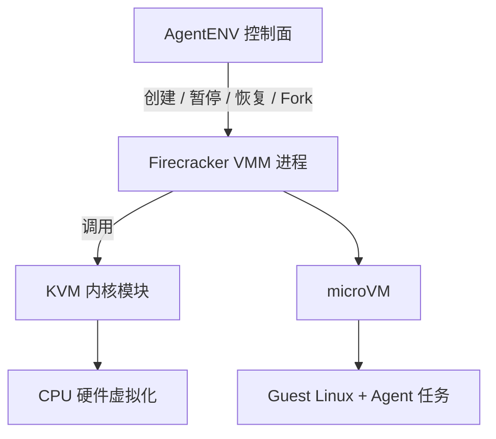
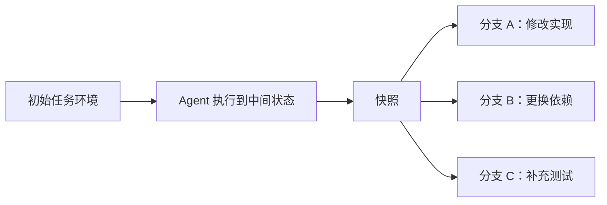
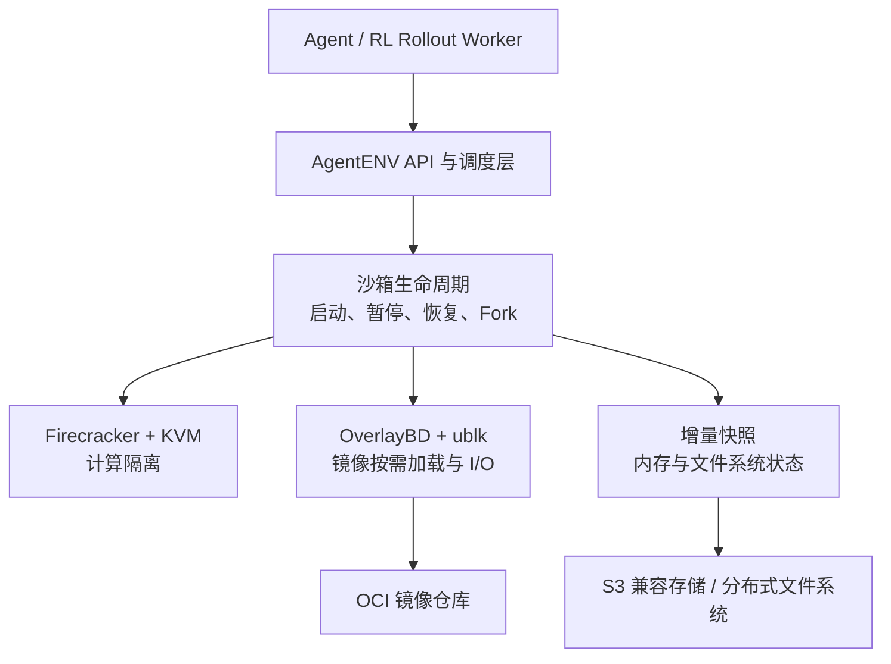

# AgentENV：为 Agentic RL 规模化运行可分叉的沙箱环境


### **Agentic RL 的瓶颈不只在模型和 GPU，还在环境：当成千上万个 Agent 同时运行代码、调用工具、修改文件并探索不同路径时，系统需要的不是更多普通容器，而是可快速启动、强隔离、可暂停、可恢复、可分叉的大规模沙箱。AgentENV 要解决的正是这个问题。**

在传统 LLM 训练中，一条样本往往只是一段静态文本。但在 Agentic RL 中，样本变成了一段持续交互的轨迹：Agent 要进入操作系统，读写文件，执行 shell 命令，安装依赖，运行测试，根据反馈继续决策。训练系统因此不仅要“喂数据”，还要为每条轨迹准备一个安全、可重现的运行世界。

[AgentENV（AENV）](https://github.com/kvcache-ai/AgentENV) 是一个面向这类工作负载的分布式平台，官方定位是“Running agent environments at scale”，并已用于 Kimi K3 的 Agentic RL 训练。它的核心价值可以压缩成一句话：**把单个隔离环境的创建与恢复，扩展成跨机器、可持久化、可弹性调度的环境基础设施。**

<!--more-->

## 为什么 Agentic RL 需要专门的环境平台

假设我们要训练一个 coding agent。对于同一个任务，系统可能需要同时采样多条轨迹：一条尝试修改依赖，一条重写函数，另一条先补测试再实现。每条轨迹都可能持续几分钟甚至更久，中间还会产生大量文件和内存状态。

这类环境与普通在线推理服务有明显区别：

- **数量大**：并行 rollout 会同时创建大量沙箱。
- **镜像多**：不同任务依赖不同的操作系统、语言工具链和项目版本。
- **寿命波动大**：有的任务几秒结束，有的会经历很长的工具调用链。
- **空闲时间多**：环境等待模型推理或外部反馈时，继续占用 CPU 和内存很浪费。
- **安全边界要求高**：Agent 会执行模型生成的命令和代码，必须把异常与潜在攻击限制在沙箱内。
- **需要分支探索**：系统最好能从同一中间状态复制出多个环境，并行尝试不同动作。

如果每次都全量下载镜像、启动完整虚拟机，暂停时仍保留全部资源，那么环境很快就会取代模型成为整条 RL 流水线的瓶颈。

## 先理清底层：进程、容器与虚拟机

理解 AgentENV，首先要理解它为什么把环境放进 microVM，而不是只启动一个普通进程或容器。

操作系统负责在应用与硬件之间分配 CPU、内存、磁盘和网络资源。正在运行的程序是进程，进程通常有自己的虚拟地址空间，但仍与其他进程共享同一个操作系统内核。容器利用 namespace、cgroup 等 Linux 机制对进程进一步隔离与限额，但容器之间仍共享宿主机内核。

虚拟机则再往前走一层：它向 guest OS 提供虚拟 CPU、内存、磁盘和网卡，guest 内部运行自己的完整内核。这会增加一些开销，但也建立了比普通容器更强的隔离边界。对于会执行不可预知代码的 Agent 来说，这笔交易很有价值。

## Firecracker：为沙箱提供轻量的虚拟机

在 Linux 上，**KVM** 是内核中的虚拟化基础设施。它借助 Intel VT-x 或 AMD-V 等硬件能力运行 guest 代码，并管理虚拟 CPU 与内存映射。但 KVM 只提供核心机制，一台可用的虚拟机还需要虚拟磁盘、网卡、启动配置和生命周期管理。

**Firecracker** 便是运行在用户态的 VMM（Virtual Machine Monitor）。它调用 KVM，并只实现 serverless 与容器工作负载需要的最小设备集。与广泛模拟各类硬件的通用虚拟机方案相比，Firecracker 的目标是更快的启动、更小的内存开销和更窄的攻击面。

需要特别澄清的是：Firecracker 不是“把 QEMU 用 Rust 重写一遍”，而是 AWS 为这类紧凑工作负载独立设计的 microVM VMM。根据 [Firecracker 官方仓库](https://github.com/firecracker-microvm/firecracker)，它的设计目标包括低于 125 ms 的启动时间和低于 5 MiB 的内存开销。



可以把三者的分工记成：**KVM 提供虚拟化“发动机”，Firecracker 把它组装成轻量 microVM，AgentENV 再把大量 microVM 变成可调度的集群资源。**

## OverlayBD：让大镜像不再阻塞启动

Firecracker 解决了“怎样快速创建隔离的计算环境”，但一台虚拟机还需要根文件系统。这些操作系统、编译器和项目依赖通常存放在镜像中。

传统流程需要在启动前下载并解压完整镜像。但一次任务往往只会读取其中很小一部分数据：为了用几个文件，先搬运整个镜像，会让冷启动成本急剧上升。当集群要支持大量不同镜像时，也不可能预先把每个镜像复制到每台机器。

[OverlayBD](https://github.com/containerd/overlaybd) 的解法是在**块设备层**实现镜像按需加载。它把 OCI 镜像展现为可挂载的虚拟块设备，环境只在真正读取某个数据块时才从远端获取它。这和流媒体播放的思路很像：不用等整部电影下载完，先取得当前需要的数据便能开始播放。

它对 AgentENV 有三个直接价值：

1. **启动与下载可以重叠**：沙箱不必阻塞在镜像的全量拉取上。
2. **本地磁盘变成有界缓存**：访问过的热数据留在本地，冷数据可以淘汰。
3. **镜像集合可以大于单机磁盘**：主机只缓存实际用到的数据，不必预热所有镜像。

因此，Firecracker 与 OverlayBD 分别处理了启动路径上的两个问题：前者降低“启动一台虚拟机”的开销，后者降低“为它准备磁盘内容”的开销。

## 快照、暂停与 Fork：为 Agent 轨迹保留中间状态

只能快速启动还不够。Agentic RL 中的环境会频繁在“执行动作”和“等待模型”之间切换。如果等待期间始终保留 vCPU 和全部 guest 内存，大规模并发会变得很昂贵。

AgentENV 通过快照支持快速暂停与恢复。按官方 README 给出的数据，基于快照的环境可在 50 ms 内启动或恢复，并在 100 ms 内暂停。内存与文件系统变更会以增量方式记录，快照可持久化到 S3 兼容对象存储或共享分布式文件系统。

更关键的是 **Fork**。它可以从一个正在运行的环境中分出多个互相独立的沙箱：



这个能力非常契合 best-of-N 采样、搜索式 Agent、树状探索和反事实轨迹生成：前缀不需要反复执行，多条候选路径可以共享同一起点，之后各自修改文件和内存状态。

AgentENV 还通过 ublk 提供高性能 I/O，在存储与内存快照数据之间共享 host page cache，并使用 memory ballooning 将 guest 中可回收的内存返还给宿主机。这些机制的目标不只是提高短时 benchmark，而是让环境在长时间运行、状态逐渐分化后，仍然维持较高密度。

## 把整条链路串起来

从 Agent 提交一个任务到环境开始执行，可以把 AgentENV 的技术栈理解为下面这条链路：



各层关注的问题不同：

- **Firecracker + KVM** 负责强隔离与轻量计算。
- **OverlayBD** 负责让 OCI 镜像按需抵达，避免全集群预热。
- **ublk 与缓存机制** 负责维持存储路径的性能和密度。
- **增量快照** 负责保存可恢复、可分叉的轨迹状态。
- **AgentENV 控制面** 负责把上述能力扩展到多台机器和海量环境。

这也是 AgentENV 与单独使用 Firecracker 的根本区别：Firecracker 解决的是“怎样运行一台轻量 microVM”，AgentENV 解决的是“怎样把海量 microVM 变成 Agent 训练可用的分布式环境服务”。

## 对 Agentic RL 的实际意义

AgentENV 本身不负责 PPO、GRPO 或奖励计算，但它会直接影响 rollout 的成本与形态。

首先，它让**环境初始化成本**降低。不同任务可以基于不同 OCI 镜像启动，又不需要让每台主机提前持有所有镜像。

其次，它让**等待中的环境变得更便宜**。环境可以在模型推理期间暂停并释放资源，得到下一个动作后再恢复。这对多轮、长周期的 Agent 任务尤其重要。

最后，快照与 Fork 让**环境成为搜索状态**。训练系统不必只保留一条线性轨迹，而可以从关键节点生成多个分支，比较不同决策的后果。这不仅是系统优化，也会扩展可以构造的训练数据类型。

## 部署前需要知道的边界

AgentENV 并不是一个可在任意笔记本上无条件运行的普通应用。按当前官方文档，部署时至少要注意：

- 服务端需要 Linux 6.8 或更高版本的内核；官方安装脚本要求 Ubuntu 24.04。
- 标准 Firecracker 部署需要访问 `/dev/kvm`；无标准 KVM 的服务器需参考官方 PVM 部署方案。
- 项目当前**没有内置鉴权**，不应将 API 直接暴露到公网；应运行在可信网络中，或在前方配置鉴权代理与网络控制。
- 它提供 E2B-compatible HTTP API，但 API 兼容不等于整个运行时实现完全相同，迁移时仍应验证具体功能与运维假设。

这些限制不会削弱它的技术价值，但会决定它适合怎样的基础设施与安全模型。

## 快速体验

如果手边有满足条件的 Linux 服务器，完成 AgentENV 服务端和 CLI 安装、执行 `aenv auth` 连接本地服务后，可以用下面两条命令拉取模板并进入沙箱：

```bash
aenv pull ubuntu:22.04 --name ubuntu
aenv start ubuntu
```

当 shell 出现时，你面对的不只是一个新进程，而是一个由 Firecracker 运行、可被 AgentENV 管理生命周期的隔离 microVM。完整的安装方式与集群部署请以 [AgentENV 官方文档](https://kvcache-ai.github.io/AgentENV/latest/) 为准。

## 结语

AgentENV 不是一个新的 RL 算法，而是 Agentic RL 的环境层基础设施。它的关键不在于发明了某一项单点技术，而在于把几类能力组合成了一条可规模化的链路：

> **Firecracker 负责快速、强隔离地创建 microVM；OverlayBD 负责让镜像即用即取；快照、暂停与 Fork 负责保存并分叉 Agent 的交互状态；AgentENV 则把这些能力变成跨机器的统一服务。**

当 Agent 训练从单轮问答走向长周期工具使用，环境就不再只是装代码的容器，而是 rollout 轨迹的一部分。谁能更便宜地创建、保存、恢复和分叉这些世界，谁才更有可能把 Agentic RL 真正扩展起来。

## 参考链接

- [AgentENV GitHub](https://github.com/kvcache-ai/AgentENV)
- [AgentENV Documentation](https://kvcache-ai.github.io/AgentENV/latest/)
- [Firecracker GitHub](https://github.com/firecracker-microvm/firecracker)
- [Firecracker Documentation](https://firecracker-microvm.github.io/)
- [OverlayBD GitHub](https://github.com/containerd/overlaybd)
- [OverlayBD Documentation](https://containerd.github.io/overlaybd/)
- [DADI: Block-Level Image Service for Agile and Elastic Application Deployment](https://www.usenix.org/conference/atc20/presentation/li-huiba)

