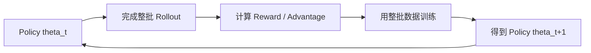
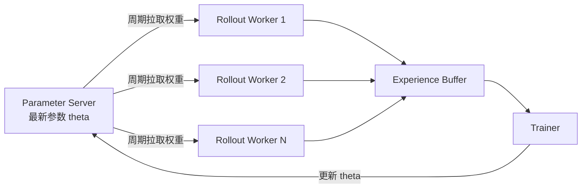
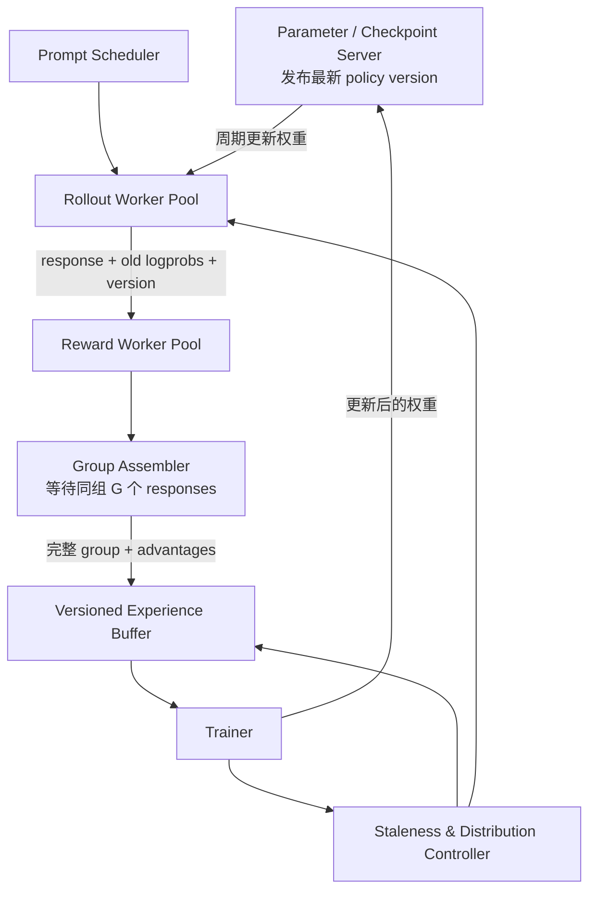

# 异步 RL：用 Policy Staleness 换掉全局 Barrier


### **异步 RL 的核心就是：rollout worker 持续生成样本，trainer 收到足够样本就立即更新，不再等待同一轮所有请求全部完成。它用一定程度的 policy staleness 换掉同步 barrier，因此 GPU 更忙、吞吐更高，但训练数据也不再严格来自当前 policy。**

如果只看系统吞吐，异步 RL 很诱人。长 CoT 请求不再把整轮训练卡住，短请求生成完就可以进入训练队列，trainer 不必陪最后几个超长样本一起发呆。

但这笔交易并不免费。同步 RL 里的等待点很烦，却也维护了一个重要假设：本轮训练数据大体来自同一个 policy snapshot。异步 RL 把这个假设拆掉之后，系统变成一条更高吞吐的流水线，同时也把 off-policy correction、数据分布偏差和样本版本管理都请上了牌桌。

<!--more-->

## 先看同步 RL 在等什么

以 LLM 的 GRPO/PPO 为例，严格同步流程通常是：



例如用 $\theta_t$ 为 1000 个 prompts 各生成 8 个 responses。即使 7999 个 responses 已经完成，只要最后一个长 CoT 还在生成，trainer 就得等。这个全局等待点就是 barrier。

问题在于，LLM 输出长度可能从几百 token 到数万 token。短请求所在的 GPU 早已闲下来，但整个 iteration 仍然不能结束。Seer 论文也把这个长尾问题作为核心动机：rollout 在多个生产级工作负载中占据总迭代时间的大头，尾部少数长请求会造成明显的资源空转。

## 完全异步 RL 怎么运行

异步系统把 rollout 和 training 拆成两套长期运行的服务，中间放一个 experience buffer 或 streaming queue：



具体循环如下：

1. Rollout worker 拉取某个版本的 policy，例如 $\theta_{100}$。
2. Worker 用它生成 response，并记录 prompt、tokens、reward、旧 policy 的 log probabilities 和 policy version。
3. 样本一完成就写进 experience buffer，不必等待同一批其他样本。
4. Trainer 只要攒够一个 minibatch，就取出数据进行一次更新。
5. Trainer 得到 $\theta_{101}$、$\theta_{102}$，持续发布最新权重。
6. Rollout worker 在适当时机刷新权重，但已经生成到一半的请求通常继续用旧版本完成。

所以在某一时刻，很可能同时发生：

- Trainer 正用 $\theta_{103}$ 更新模型；
- worker A 使用 $\theta_{102}$；
- worker B 仍在完成由 $\theta_{100}$ 开始的长请求；
- buffer 中同时存在多个 policy version 的经验。

这不是实现错误，而是异步设计允许的正常状态。

## 为什么它更快

同步系统的 iteration 时间接近最慢 request 的完成时间：


\[ T_{\mathrm{sync}} \approx \max_i T_i + T_{\mathrm{train}} \]


如果 rollout 和 training 不能重叠，两段耗时还需要相加。

异步系统进入稳态后，更接近一条 producer-consumer pipeline：


\[ \mathrm{Throughput}_{\mathrm{async}} \approx \min \left( \mathrm{RolloutRate}, \mathrm{TrainConsumeRate} \right) \]


只要 buffer 不空，trainer 就一直训练；只要 buffer 没满，rollout workers 就一直生成。长请求只会晚一点进入 buffer，不再挡住所有其他样本。GPU 终于不用集体陪最后一个长 CoT 发呆。

举个例子：

- 100 个 requests 中，90 个各用 10 秒；
- 10 个长 requests 各用 100 秒；
- trainer 每拿到 32 个 samples 就能更新。

同步方案必须等长请求完成后才开始这轮训练。完全异步方案在最早 32 个短请求完成后就能启动训练，同时 rollout workers 继续生成剩余数据。

## 异步到什么程度，有不同档位

“异步 RL”并不是一个单一算法，更像一条光谱。

### 1. 阶段内部异步，但 iteration 仍同步

reward computation 可以在 response 完成后立即执行，或者一边 rollout 一边计算 reward。最终系统仍等待本轮所有样本完成，再统一训练。

这种方式只是工程 pipeline overlap，通常不引入 policy staleness，严格来说不属于完全异步 RL。Seer 就使用了 asynchronous reward backend，但 rollout 与下一轮 policy update 之间仍保持同步 barrier。

### 2. Partial Rollout / 非严格同步

系统超额发出 requests。例如本轮需要 6400 个样本，就先发 12800 个。收齐前 6400 个便结束本轮，尚未完成的长请求被暂停、延期到下一轮，或下一轮优先完成。

它仍保留“轮次”的外观，但本轮进入训练的数据偏向生成快的短样本。Seer 论文把这类方案称为 non-strictly synchronous，而不是完全异步，并指出 Partial Rollout 会显著改变输出长度分布。

### 3. 完全流式异步

没有清晰的 rollout iteration barrier。Rollout workers、reward workers 和 trainer 都长期运行，buffer 不断流入和流出数据。Trainer 每收到足够经验就更新，权重按照固定步数或时间间隔广播。

这类系统吞吐潜力最大，同时 policy staleness 和样本分布控制也最困难。

## 最大的算法问题：数据变成 off-policy

假设一个 response 是旧 policy $\mu=\pi_{\theta_{100}}$ 生成的，但训练时最新 policy 已经是 $\pi_{\theta_{105}}$。Trainer 实际优化的是新 policy，却在使用旧 policy 采集的数据：


\[ a_t \sim \mu(\cdot\mid s_t) \quad\text{而非}\quad a_t \sim \pi_\theta(\cdot\mid s_t) \]


两者相差越大，直接使用 policy-gradient estimator 的 bias 越严重。

常见修正是 importance sampling：


\[ r_t(\theta) = \frac{\pi_\theta(a_t\mid s_t)} {\mu(a_t\mid s_t)} \]


PPO 会对 ratio 做 clipping：


\[ L^{\mathrm{clip}}(\theta) = \mathbb{E}_t \left[ \min \left( r_t(\theta)A_t,\, \operatorname{clip} \left(r_t(\theta),1-\epsilon,1+\epsilon\right)A_t \right) \right] \]


因此 rollout worker 必须保存 behavior policy 的 log probability：


\[ \log \mu(a_t\mid s_t) \]


训练时再计算当前 policy 的：


\[ \log \pi_\theta(a_t\mid s_t) \]


二者相减即可得到 log importance ratio。

但 correction 不是魔法橡皮擦。若 policy 已变化很大，ratio 会极端化；clipping 虽能抑制方差，却也引入 bias。对几十万 token 的整条 LLM trajectory，逐 token ratio 的误差还可能累积。因此工程系统通常还会限制 staleness，而不是任由旧数据在 buffer 里养老。

## 系统通常怎样控制 staleness

### 记录 policy version

每条 experience 都附带生成它的 policy step：

```text
sample.policy_version = 100
trainer.current_version = 105
staleness = 5
```

若超过阈值，可以丢弃、降权或重新计算。

### 限制 buffer 年龄

Experience buffer 采用 FIFO，设置最大容量和 maximum sample age。旧数据不能无限积压。

### 周期同步 rollout 权重

worker 每完成若干 requests、每隔若干秒，或每到 generation boundary 时拉取最新 checkpoint。同步太频繁会增加权重广播成本；同步太慢则增加 staleness。

### 限制 trainer 与 rollout 的速度差

若 trainer 更新太快，旧样本马上过期；若 rollout 太快，buffer 堆积。系统会通过 backpressure、动态 batch size 或调整 GPU allocation 让 producer 和 consumer 速率接近。

### 采用 off-policy correction

除了 PPO clipping，还可使用 truncated importance sampling、V-trace 风格 correction、KL penalty，以及按 policy lag 给样本加权。不过 correction 能否适用于具体 GRPO objective，需要单独推导，不能把任何 actor-critic 技巧直接贴上去便宣布万事大吉。

## 第二个问题：短样本偏差

异步 trainer 按“谁先完成就先消费谁”的方式取样，会产生 completion-time bias。

假设一批数据中：

- 简单题平均生成 2000 tokens；
- 困难题平均生成 30000 tokens。

前几个训练 minibatches 会被简单题和短 responses 占满。Policy 更新后，后到达的长样本又是旧 policy 生成的，因此长样本同时遭遇：

1. 更高 staleness；
2. 更晚进入训练；
3. 可能因 buffer age 被丢弃；
4. 在固定训练预算下被消费得更少。

这会改变实际训练分布：


\[ p_{\mathrm{train}}(x) \neq p_{\mathrm{prompt}}(x) \]


而且偏差不是随机的，它和 difficulty、output length、reward、reasoning style 可能相关。Seer 论文批评异步和 Partial Rollout，重点就在这里：快生成的短样本会不成比例地进入较早 training batches。

常见缓解办法包括按 prompt class 或长度分层采样、为慢样本保留 quota、基于采样概率加权，以及在 buffer 中保持目标数据分布。但做了这些控制后，系统可能又要等待某些慢桶，等于偷偷把一部分 barrier 请回来了。

## GRPO 异步化还有一个特殊麻烦

GRPO 对同一 prompt 的 $G$ 个 responses 做组内 reward normalization。典型 advantage 是：


\[ A_i = \frac{ r_i-\operatorname{mean}(r_1,\ldots,r_G) }{ \operatorname{std}(r_1,\ldots,r_G)+\delta } \]


因此，单个 response 完成后不能立即得到最终 group advantage；通常要等同组 $G$ 个 responses 的 reward 都准备好。

这意味着异步 GRPO 往往不是按“单 response”流入 trainer，而是按“完成的 prompt group”流入。实现上可以：

1. 每个 response 完成后进入 group assembler；
2. assembler 按 `group_id` 收集 $G$ 个 responses；
3. 整组到齐后计算 reward normalization 和 advantage；
4. 将完整 group 写入 training buffer；
5. trainer 从多个已完成 groups 中组成 minibatch。

这样仍然消除了**全局 barrier**，但保留了**组内 barrier**。一个特别长的 response 只会拖慢它自己的 group，不再拖慢所有 prompts。

另一种做法是使用 running baseline 或跨组 reward normalization，不等完整 group，但这已经改变 GRPO estimator，属于算法修改，而不只是系统异步化。

## 一个比较完整的异步 LLM RL 架构



每条训练样本至少应保存：

- prompt 和 response tokens；
- reward 与 advantage；
- behavior policy 的 token-level log probabilities；
- policy version；
- sampling parameters；
- group ID；
- generation start/end time；
- 必要时保存 value estimate、mask 和 truncation information。

缺少 policy version 和 old logprobs，就很难判断样本究竟有多 off-policy，也无法做可靠 correction。

## 它和 Seer 的根本区别

| 维度 | 异步 RL | Seer |
|---|---|---|
| Rollout 与 training | 重叠执行 | 按 iteration 交替 |
| 是否等待整批 rollout | 通常不等待 | 等待本轮全部完成 |
| 数据 policy 版本 | 可能来自旧版本 | 本轮使用同一 policy snapshot |
| 长尾处理 | 不让长请求阻塞 trainer | 加速并重新调度长请求 |
| 主要收益来源 | pipeline overlap、取消全局 barrier | load balancing、length-aware scheduling、grouped SD |
| 主要风险 | staleness、off-policy bias、短样本偏差 | 系统复杂度、依赖组内相关性和全局 KVCache |

一句话概括：

> **异步 RL 是“不等慢请求”；Seer 是“仍然等，但让慢请求更早开始、更均匀分布、生成得更快”。**

这个区别很重要。异步 RL 直接改变 rollout 与 training 的时间关系，代价是引入 off-policy 数据；Seer 仍站在同步 RL 这边，努力把长尾压短，以保留 on-policy 训练的算法语义。

## 什么时候值得异步

异步 RL 更适合以下场景：

- rollout 和 training 能被明确放在不同 GPU pools；
- rollout 特别慢，pipeline overlap 收益巨大；
- 算法能容忍一定 policy lag；
- reward 或 environment 本身就有高延迟；
- 目标优先级是 wall-clock throughput，而非严格复现；
- 有成熟的 versioning、buffer 和 distribution monitoring。

严格同步更适合：

- policy update 很激进，旧样本很快失效；
- reward 对长推理样本特别敏感；
- 需要稳定、可复现的实验；
- 正在验证算法本身，不希望系统引入额外变量；
- GRPO group integrity 和当前-policy 一致性非常重要。

真正落地时，常用方案往往在两端之间：异步 reward、流式 group assembly、有限 staleness rollout，以及带版本上限的 experience buffer。完全同步太爱等人，完全异步又容易把训练数据炖成“跨时代大杂烩”；工程上通常选择受控异步。

## 参考链接

- [Seer: Online Context Learning for Fast Synchronous LLM Reinforcement Learning](https://arxiv.org/abs/2511.14617)

