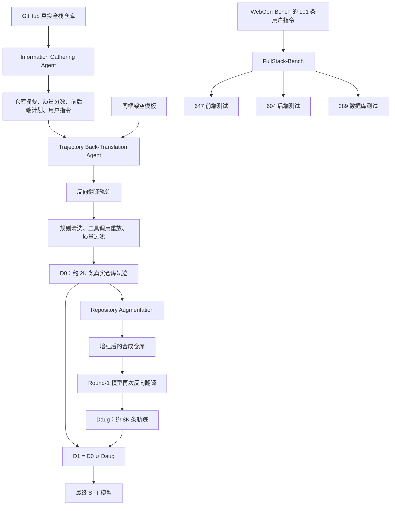

# FullStack-Agent：全栈 Coding Agent 的训练与评测数据是如何构造的


很多“网页生成 Agent”看起来已经能做出漂亮页面：按钮能点，表单能提交，页面还能弹出“保存成功”。但如果继续追问两步，问题就会暴露出来：数据真的写进数据库了吗？刷新页面之后还能读回来吗？后端 API 是否真的存在？

`FullStack-Agent` 这篇论文的核心贡献，正是把网站生成从“看起来像全栈”推进到“前端、后端和数据库都能被验证”。不过，论文里更值得仔细看的其实不只是 Agent 框架，而是它的数据构造方法：**它如何把真实网站代码库转换成 Coding Agent 的训练轨迹，又如何构造能够识别假后端的评测数据？**

本文只讨论这两个问题。论文原文是 [FullStack-Agent: Enhancing Agentic Full-Stack Web Coding via Development-Oriented Testing and Repository Back-Translation](https://arxiv.org/abs/2602.03798)，代码仓库见 [GitHub](https://github.com/mnluzimu/FullStack-Agent)。

<!--more-->

## 先区分四类数据对象

理解这篇论文最容易犯的错误，是把“仓库”“轨迹”“用户指令”和“测试用例”混成一个数据集。实际上，论文中至少有四类不同对象：

| 数据对象 | 含义 | 用途 |
| --- | --- | --- |
| 真实网站仓库 | 从 GitHub 爬取的全栈 Web 项目 | 作为训练数据的代码种子 |
| Agent 轨迹 | Agent 读取文件、修改代码、运行命令和调试的完整过程 | 用于 SFT，训练 Coding Agent |
| 用户指令 | 描述目标网站应该具备什么功能的自然语言需求 | 连接用户需求与网站实现 |
| 测试用例 | 对前端交互、后端 API 或数据库状态的具体检查 | 用于 FullStack-Bench 评测 |

因此，训练数据和评测数据的关系不是“同一批样本换个名字”：训练阶段主要学习如何开发，评测阶段主要检查开发结果是否真的实现了功能。

整体可以概括成下面这条流水线：



## 一、训练数据：把代码仓库反向翻译成开发轨迹

### 1. 为什么不直接让模型从用户指令生成代码

最直接的做法是准备一批用户需求，然后让模型从空目录开始生成网站，把生成过程保存下来作为 SFT 数据。这种方法的问题是，模型很容易生成“表面合理”的代码：页面结构完整、交互反馈存在，但数据流并没有真正打通。

而且，从零生成一个复杂全栈项目，模型在数据生成阶段本身就可能失败。失败样本太多，后续还要区分到底是需求不合理、模型不会写，还是环境没有搭好。

`FullStack-Learn` 采取了一个更稳的方向：先找已经存在的真实网站仓库，再把它转换成类似“从需求开始开发”的 Agent 轨迹。也就是先获得一个可运行、功能相对完整的目标，再让 Agent 学习如何把它实现出来。

### 2. 第一个 Agent：理解仓库，而不是直接写代码

`Information Gathering Agent` 的任务不是修改仓库，而是先把仓库读懂。它使用目录导航、文件读取和代码搜索工具，分析项目的结构与功能，并输出一份中间摘要，至少包括以下内容：

- 仓库整体功能描述；
- 一个质量分数，用于之后过滤低质量仓库；
- 前端开发计划，包括页面、组件和交互；
- 后端开发计划，包括实体、数据结构和 API；
- 一个能够合理产生该仓库的自然语言用户指令。

这里的用户指令不是从真实用户日志中直接拿来的，而是 Agent 根据仓库反推出的“逆向需求”。例如，一个仓库里有商品列表、购物车和订单 API，Information Gathering Agent 需要生成一条类似“请开发一个支持商品浏览、加入购物车和订单管理的网站”的需求。

这个步骤很关键，因为它把一个具体代码库抽象成了三种可复用信息：

```text
真实仓库
  ├── 它是什么
  ├── 应该实现什么前端功能
  ├── 应该实现什么后端和数据库功能
  └── 用户会怎样描述这个需求
```

之后的轨迹生成不再只是复制文件，而是受到用户指令和前后端计划的约束。

### 3. 第二个 Agent：在空模板中重建仓库

`Trajectory Back-Translation Agent` 同时获得：

1. Information Gathering Agent 生成的用户指令；
2. 前端和后端高层计划；
3. 原始仓库；
4. 一个与原项目使用相同 Web 框架的空模板。

它的工作方式是：阅读原始仓库中的相关文件，然后在空模板中重新实现这些功能。论文特别强调，Agent 的操作顺序应尽量接近正常开发过程：

```text
阅读项目结构
    ↓
阅读相关配置和源码
    ↓
设计或确认实现方案
    ↓
创建文件、修改代码
    ↓
启动服务
    ↓
调试前端交互和后端 API
```

这里的“反向翻译”可以理解为把一份已有的程序，翻译成一段“如果从需求开始，开发者会怎样逐步写出它”的操作历史。它和普通代码复制的区别在于，最终训练数据不是单纯的最终仓库，而是包含思考上下文、工具调用和中间状态的轨迹。

### 4. 为什么还要做规则清洗

反向翻译 Agent 在生成轨迹时看过原仓库。如果不清洗，训练样本会泄漏很多不应该出现的信息，例如：

- “原仓库已经有这个文件”；
- 直接读取原项目的绝对路径；
- 工具输出中包含原仓库内容；
- 轨迹中的项目名、路径和历史记录仍然指向旧项目。

论文因此使用了一个规则程序，把反向翻译轨迹转换成正常的 Coding Agent 轨迹。附录 C 给出的处理逻辑大致分成七步。

#### 第一步：工作区归一化

把自然语言消息和工具参数中的文件路径，统一改写成一个新的项目路径。这样轨迹看起来始终是在同一个新项目中工作。

#### 第二步：提示词规范化

将原来带有“阶段性转录任务”含义的用户消息，替换成标准的 Coding Agent 提示词。新的提示词只依赖：

- 用户指令；
- 当前阶段的前端或后端计划；
- 空模板的框架指导。

#### 第三步：清理叙事和历史

删除对旧仓库的描述，并把新仓库的称呼统一起来，避免模型从文本中获得“这是在复制某个已知仓库”的提示。

#### 第四步：删除依赖旧仓库的工具调用

如果某个工具调用依赖原仓库之外的路径，就删除对应的 Agent 消息和工具响应。这样可以避免保留无法在正常开发环境中复现的步骤。

#### 第五步：重置确定性的初始环境

把新项目重置到统一的初始状态，并启动绑定到新路径的工具运行时。

#### 第六步：按时间顺序重放工具调用

对于会修改项目状态的操作，重新执行它；对于读取项目状态的操作，重新计算工具输出。比如，`read_file` 的输出不能继续使用旧仓库中的结果，而应该从清洗后的新项目中重新读取。

#### 第七步：注入新的工具输出

用重放得到的结果替换原轨迹中的工具响应，得到最终的训练轨迹 `T'`。

可以把整个转换过程写成：

```text
原始反向翻译轨迹 T
    ↓ 统一路径
    ↓ 规范化提示词
    ↓ 删除旧仓库引用和无效工具调用
    ↓ 在新项目上重放操作
    ↓ 重新计算工具输出
清洗后的开发轨迹 T'
```

这一步的本质不是简单脱敏，而是一次**轨迹重建**：它确保每个工具输出都和清洗后的项目状态一致。

## 二、训练数据过滤：不是“生成出来就能用”

即使轨迹被成功生成，也不意味着网站质量合格。论文使用 FullStack-Dev 中的前端和后端调试工具，对每条轨迹计算三个信号：

1. 前端外观质量；
2. 前端功能质量；
3. 后端功能质量。

前端外观和功能分数直接从前端调试工具的摘要中读取，原始范围是 1～5。后端分数则根据 API 响应规则化：

| API 结果 | 后端分数 |
| --- | ---: |
| HTTP 200 且返回数据非空 | 1 |
| HTTP 200 但返回数据为空 | 0 |
| HTTP 状态码不是 200 | -1 |

一条轨迹通常会触发多次前端或后端调试调用，所以作者不是只看最后一次结果，而是进行折扣聚合：

$$
s_{aggregate} = \sum_{i=1}^{N} \gamma^{N-i}(s_i-s_{thresh})
$$

其中 `γ = 0.9`。这个权重意味着越接近最终状态的调试结果权重越高，早期结果的影响逐渐减小。

- 外观分数的阈值为 `3`；
- 前端功能分数的阈值为 `3`；
- 后端功能分数的阈值为 `0`。

只有当三种聚合分数全部大于 0 时，轨迹才会保留。也就是说，网站即使页面能渲染，只要后端 API 不能返回有效数据，整条轨迹就可能被过滤掉。

这个过滤策略传递了一个很明确的训练目标：模型不只要写出能启动的项目，还要写出有功能、有数据流、能通过调试的项目。

## 三、Repository Augmentation：从一个仓库生成多个变体

仅依靠真实仓库，轨迹数量会受到可用项目数量和生成成本限制。论文进一步提出 `Repository Augmentation`，对已有仓库做功能级增强。

`Augmentation Planning Agent` 先理解原仓库，再提出五种计划：

- 一个简化计划；
- 一个功能扩展计划；
- 三个应用迁移计划。

应用迁移计划的含义，是保留原仓库相似的代码结构，但把它转成另一个应用。例如，原项目是任务管理系统，迁移计划可能要求构造一个结构相似的课程管理系统。

然后，`Augmentation Implementing Agent` 分别执行这些计划。它不仅修改代码，还会运行前端和后端调试工具修复破坏性问题。轨迹结束时，Agent 还要根据历史消息和当前代码状态检查计划是否完整实现，只有验证通过的合成仓库才被保留。

这比直接从零生成五个新项目更容易，因为原仓库已经提供了：

- 可参考的目录结构；
- 已经验证过的依赖关系；
- 一套可迁移的组件和 API；
- 可以运行的数据库操作；
- 可以复用的调试流程。

论文称该过程可以产生原仓库数量五倍的数据，但实验中实际报告的是约 `8K` 条增强轨迹。这里需要谨慎理解：`8K` 是轨迹规模，不一定等于 `8K` 个唯一仓库；论文也没有详细解释五个增强计划最终各自的成功率和为什么最终采用 `8K` 这个数字。

## 四、Iterative Self-Improvement：让模型生成下一轮训练数据

论文的迭代训练可以用下面的符号表示：

```text
M0：原始 Qwen3-Coder-30B-A3B-Instruct
Rreal：GitHub 真实仓库
B：Repository Back-Translation
A：Repository Augmentation
U：SFT 更新
```

第一轮：

```text
D0 = B(Rreal, M0)       # 约 2K 条真实仓库轨迹
M1 = U(M0, D0)           # 得到 Round-1 模型
```

第二轮：

```text
Raug = A(Rreal, M0)      # M0 生成增强仓库
Daug = B(Raug, M1)       # M1 反向翻译增强仓库
D1 = D0 ∪ Daug           # 合并约 10K 条轨迹
Mfinal = U(M0, D1)       # 训练最终模型
```

这里有一个容易忽略的设计：第一轮由 `M0` 生成真实仓库轨迹；第二轮的增强仓库由 `M0` 生成，但用已经通过第一轮训练得到的 `M1` 进行反向翻译。也就是说，模型先从真实项目中学习，再利用更强的自身版本扩大数据规模。

实验中两轮 SFT 使用：

- 2 个 epoch；
- 学习率 `2e-5`；
- batch size `32`；
- `32` 张 H800 GPU。

论文报告的训练规模如下：

| 轮次 | 数据 | 说明 |
| --- | --- | --- |
| Round 1 | Crawled `2K` | 基于 GitHub 仓库反向翻译 |
| Round 2 | Crawled `2K` + Augmented `8K` | 真实仓库轨迹与增强仓库轨迹合并 |

为了说明反向翻译的价值，论文还比较了两种 2K 数据：直接从用户指令生成的轨迹，以及通过真实仓库反向翻译生成的轨迹。后者在考虑有效数据库交互的前端准确率上达到 `42.3%`，后端达到 `45.4%`；直接生成数据分别只有 `36.2%` 和 `33.6%`。这说明真实仓库提供的不只是代码样例，还提供了更接近生产开发的结构、依赖和数据流。

## 五、评测数据：FullStack-Bench 如何识别“假全栈”

训练数据解决的是“怎么让模型学会开发”，评测数据解决的是“怎么确认它真的开发出来了”。FullStack-Bench 将一个网站拆成三个互补维度：

| 测试类型 | 数量 | 来源与目标 |
| --- | ---: | --- |
| 前端测试 | 647 | 继承 WebGen-Bench，检查 GUI 交互和页面结果 |
| 后端测试 | 604 | 新构造，检查 API 是否存在且返回正确结果 |
| 数据库测试 | 389 | 新构造，检查数据表结构和内容 |
| 用户指令 | 101 | 继承 WebGen-Bench |

每条用户指令通常会对应多个前端、后端和数据库测试用例，因此 `101` 不是网站数量与测试数量的一一对应关系。

### 1. 前端测试：页面表现必须有数据库证据

前端测试使用 GUI Agent 执行用户操作，例如打开页面、填写表单、创建记录、筛选列表等。结果分为：

- `YES`：功能完整成功；
- `PARTIAL`：部分完成；
- `NO`：失败。

传统前端评测只看页面上有没有出现预期元素或提示，容易把“点击按钮后弹出成功提示”误判成真实成功。FullStack-Bench 在 GUI 交互期间同步收集数据库日志，并在测试结束时再次检查：

```text
页面出现预期结果
        +
数据库日志显示正确的写入/读取操作
        =
前端测试才算有效
```

所以前端准确率不再只是 GUI Agent 的判断结果。只有数据库交互检查通过，`YES` 和 `PARTIAL` 才会计入最终得分。

准确率公式为：

$$
Accuracy = \frac{N_{Yes}+0.5N_{Partial}}{N_{Total}}\times100\%
$$

这相当于保留 WebGen-Bench 的部分成功评分，同时增加了数据流约束。

### 2. 后端测试：先理解 API，再发请求

后端测试不是直接把一个固定请求扔给网站。评测 Agent 会先收集当前项目中的后端 API 信息，然后再针对每个测试用例发起请求：

1. 找出相关的 API endpoint；
2. 确认请求方法和参数；
3. 发起请求；
4. 读取响应和后端日志；
5. 判断功能是否满足需求。

不同后端测试共享前面的 API 信息收集过程，以减少重复计算。每条后端测试最终只有 `YES` 或 `NO`，准确率就是通过的测试数除以总测试数。

### 3. 数据库测试：用快照检查持久化结果

数据库测试不依赖页面截图，也不完全依赖 API 返回值，而是直接检查数据库状态。

作者从每张表中提取：

- 所有列名；
- 前五行数据。

然后将其组织成 JSON 快照交给评测模型，由模型判断当前数据库是否满足测试需求。例如，需求是“保存一个订单”，数据库测试不仅要看接口是否返回成功，还要看对应表是否存在合理记录。

这种方法的优点是能发现两类伪实现：

- API 返回了写死的成功 JSON，但没有写数据库；
- 页面展示了 mock 数据，但数据库中没有对应实体。

它的限制也很明显：只查看前五行，无法完整验证大规模数据集上的约束、索引、权限和复杂事务。

## 六、人工验证：验证的是评测证据，不是网站好不好

为了检查评测流水线本身是否可靠，作者从三类测试中各随机抽取 `200` 条样本，共 `600` 条，由 `4` 名具有计算机相关背景的本科生进行人工检查。

判定标准不是“这个网站在现实中是否完美”，而是：**评测轨迹和数据库交互日志，是否足以支持最终的 YES、PARTIAL 或 NO 判断。**

人工一致率为：

| 测试类型 | 人工一致率 |
| --- | ---: |
| 前端 | 90.5% |
| 后端 | 94.0% |
| 数据库 | 97.5% |

三类结果都超过 90%，说明自动评测大体能够根据执行证据做出可靠判断，但它并不等价于完整的人类代码审查。

## 七、这套数据构造方法真正解决了什么

### 1. 从“最终代码”转向“开发过程”

最终仓库只能告诉模型“答案长什么样”，轨迹则包含：

- 如何定位文件；
- 如何理解依赖；
- 如何拆分前后端任务；
- 如何验证 API；
- 如何根据错误继续修改。

对 Coding Agent 来说，这些中间过程本身就是需要学习的能力。

### 2. 从“页面看起来对”转向“数据流真的通”

数据库日志同时进入前端和后端评测，使得测试结果必须和实际存储行为一致。这是全栈评测与普通网页截图评测最大的区别。

### 3. 从“模型失败就丢弃”转向“利用真实项目降低生成难度”

真实仓库、空模板和仓库增强共同构成了一个中间状态：Agent 不需要凭空发明完整系统，但仍然要执行足够多的阅读、规划、编码和调试动作。

### 4. 训练和评测形成了闭环

训练数据用调试工具过滤，评测数据又用数据库日志检查数据流。两者都把“可执行、可观察、可验证”放在比单纯文本质量更高的位置。

## 八、论文没有完全说明的地方

这篇论文的流程描述比较完整，但从复现角度看仍有几个空白：

1. 没有给出完整的 GitHub 仓库列表；
2. 没有详细说明 GitHub 仓库的爬取条件、去重规则和初始质量门槛；
3. “Crawled 2K”明确指最终的 2K 条训练轨迹，但不等于已经公开说明有 2K 个唯一仓库；
4. 文中说增强过程产生原仓库数量五倍的数据，但实验表使用的是 `8K` 条增强轨迹，二者之间的成功率和过滤过程没有完全展开；
5. 数据库测试只使用表结构和前五行快照，复杂约束、权限、并发和事务一致性没有被充分覆盖；
6. LLM 标注和人工修订的具体分工、每个测试用例的生成提示词和修订比例，主要放在附录提示词与实现中，没有在正文中量化说明。

因此，论文更适合被理解为一套数据构造范式，而不是一个拿来即可完全复刻的数据集发布说明。

## 结语：全栈 Agent 的训练数据，关键是“可重放”和“可验证”

`FullStack-Agent` 的数据构造可以压缩成一句话：

> 用真实仓库提供工程结构，用反向翻译生成开发轨迹，用规则重放保证轨迹一致性，用调试和数据库日志过滤与评测。

它的价值不在于单纯把 `2K` 扩成 `10K`，而在于把训练样本从“用户需求—最终代码”升级成了包含计划、工具调用、项目状态和调试反馈的完整开发过程；同时把评测从“页面是否出现某个效果”升级成“前端结果是否有后端和数据库证据支持”。

这也是全栈 Coding Agent 数据与普通代码数据最重要的区别：**代码只是最终产物，数据流和开发过程才是需要被学习、被验证的对象。**

## 参考资料

- [FullStack-Agent 论文摘要](https://arxiv.org/abs/2602.03798)
- [FullStack-Agent 论文 HTML 全文](https://arxiv.org/html/2602.03798v1)
- [FullStack-Agent 论文 PDF](https://arxiv.org/pdf/2602.03798v1)
- [FullStack-Agent GitHub 仓库](https://github.com/mnluzimu/FullStack-Agent)

