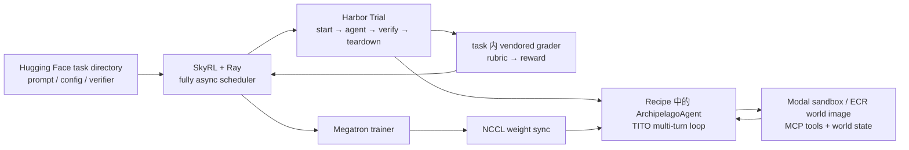
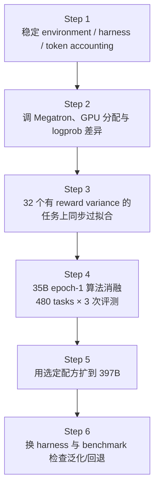
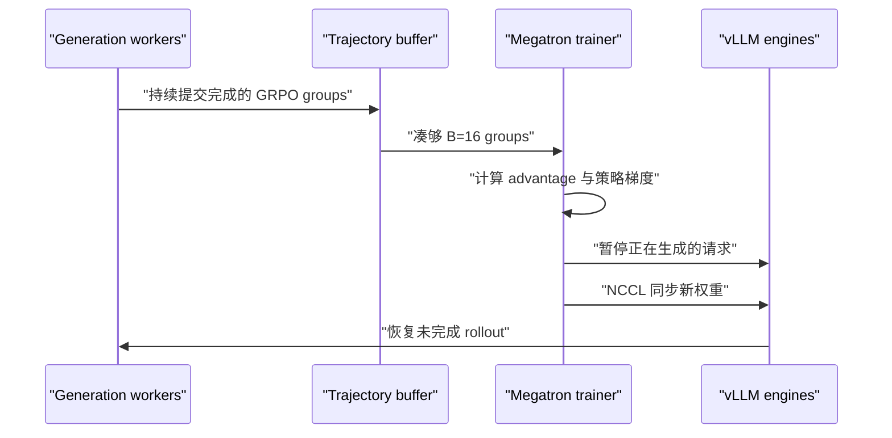

# 训练 397B 知识工作 Agent：Mercor × SkyRL 的六步 RL 配方，以及 Archipelago 到底负责什么


Mercor 与 SkyRL 发布的 [Training frontier knowledge work agents: A 397B RL training guide with SkyRL](https://www.mercor.com/blog/training-frontier-knowledge-work-agents-a-397b-rl-training-guide-with-skyrl/) 很容易被压缩成一句话：他们用 1,928 个专家任务训练 Qwen3.6-35B-A3B 与 Qwen3.5-397B-A17B，让后者在 APEX-Agents 上的 Pass@1 从 16.11% 提高到 27.29%，相对提升约 69%。

但这不是文章最值得复用的部分。知识工作 Agent 的一次 rollout 可能持续几十轮、跨越 2K 到 128K 以上 token，期间还要操作文件、表格、邮件、浏览器和专业数据工具。此时 RL 失败，原因未必是算法：环境可能没有正确复位，grader 可能漂移，工具 observation 可能被错误计入 loss，生成端与训练端可能重新分词出不同 token，异步 rollout 也可能已经落后多个 policy version。

Mercor 真正公开的是一套执行顺序：**先证明环境、harness、token accounting 和分布式训练没有欺骗你，再做算法消融；先在 35B 上筛配方，再把同一配方扩到 397B；最后换 harness、换 benchmark 检查是否只学会了评测器。**

本文同时分析用户给出的 [Mercor-Intelligence/archipelago](https://github.com/Mercor-Intelligence/archipelago)。一个必须先说清的结论是：**Archipelago 不是 397B 训练器。** 它提供环境、Agent runner 与 grading harness；Harbor 管一次 trial 的生命周期；SkyRL 管 fully async RL、Megatron 训练、vLLM 推理与权重同步；真正把这些模块接起来的是另一个独立仓库 [ApexAgents-SkyRL-Recipe](https://github.com/Mercor-Intelligence/ApexAgents-SkyRL-Recipe)。

本文信息与代码核查截止 **2026-09-02**。实验结果来自 Mercor/SkyRL 团队公开材料，尚无第三方独立复现；私有训练任务、world images、部分 verifier 与完整集群运行记录未公开，因此本文会区分“代码可核查”“配置可重建”和“结果可复现”。

<!--more-->

## 30 秒结论

1. **最强贡献是 de-risking 顺序，而不是某个新 loss。** 六步流程中的前三步都在排除环境、harness、token 和分布式系统风险，作者明确没有先做 SFT warmup。
2. **Archipelago、Harbor、SkyRL、recipe 是四个不同层。** Archipelago 提供可交互世界与评分框架；Harbor 启停 trial；SkyRL 生成、训练和同步权重；recipe 复刻/封装 Archipelago 风格的 Agent，并把 reward 接回 SkyRL。
3. **TITO 是多轮 Agent RL 的地基。** 训练直接保存生成端实际采样的 token ID、逐 token rollout logprob 和 loss mask，避免把文本重新 tokenize 后让“模型实际做的动作”与“trainer 以为的动作”错位。
4. **消融里最清晰的单项收益来自 `prompt_mean`。** Mean Reward 从 28.69% 提到 32.54%；DPPO 单项只有 +0.34 个点，落在评测噪声内，但显著改变了行为长度与回合结构。
5. **最终结果支持“学到了可迁移能力”，但证据仍有限。** 两个模型在 OpenCode harness 和 Terminal-Bench 2.1 上也提升，HLE/GPQA 没有明显回退；不过训练数据、world images、精确 grader 和成本没有公开。
6. **“397B”是总参数量，不是每个 token 都激活 397B 参数。** Qwen3.5-397B-A17B 是 MoE，单 token 约激活 17B 参数；但参数存储、通信、checkpoint 和专家并行仍然按超大模型问题处理。

## 1. 训练对象不是聊天回答，而是一个长程工作过程

### 1.1 APEX-Agents 测什么

[APEX-Agents](https://arxiv.org/abs/2601.14242) 面向三类专业知识工作：法律、管理咨询和投资银行。公共 benchmark 包含 480 个任务、33 个 worlds，每个职业 160 个任务。论文还报告，一个 world 平均包含约 166 个文件、9 个应用和 63 个工具，数据制作涉及 256 位领域专家。

这里的 world 可以理解为一个模拟公司或案件空间：它有自己的文档、邮件、表格、应用状态和 MCP 工具。Agent 不是回答一道静态问答题，而是在这个状态空间中读取材料、调用工具、修改产物，最后由 verifier 对交付物和世界状态进行评分。

Mercor 用于 RL 的数据不是这 480 个公开评测任务，而是另一组 **1,928 个 OTS（occupational task simulation）专家任务、112 个 worlds**。团队声称训练集与公开 APEX benchmark 在 prompt 和 world 上都没有重合，但训练集没有公开，外部目前无法独立审计去重过程。

| 数据 | 规模 | 用途 | 公开状态 |
| --- | ---: | --- | --- |
| APEX-Agents benchmark | 480 tasks / 33 worlds | 主评测集 | 任务数据公开，但部分 trace 受限 |
| Mercor RL 训练集 | 1,928 tasks / 112 worlds | 35B、397B RL | 未公开 |
| APEX-Agents 制作 | 256 位专家 | 任务与 rubric 设计 | 论文披露统计，原始过程不完全公开 |

### 1.2 Mean Reward 与 Pass@1 不是一个指标

每个任务包含多个 rubric criteria。若一个任务有 $K$ 条标准，Agent 满足其中 $k$ 条，则可以把稠密 reward 理解为：

$$
R_{\text{mean}}=\frac{k}{K}.
$$

Mercor 报告的 `Mean Reward` 是跨任务平均后的 rubric 完成比例，适合给 RL 提供比 0/1 更稠密的信号；`Pass@1` 则要求一次运行满足全部标准：

$$
\operatorname{Pass@1}=\mathbb{E}\left[\mathbf 1(k=K)\right].
$$

因此 Mean Reward 上升但 Pass@1 不动，可能表示模型学会了完成更多子目标，却仍经常漏掉最后一两项硬要求。反过来，Pass@1 是更严格、更接近“交付能否一次通过”的指标，但统计方差也更大。

## 2. 先拆清四层系统：谁提供世界，谁运行 trial，谁做 RL

把公开仓库和训练 recipe 对齐后，一条训练 trajectory 的真实链路可以画成：



四层职责如下：

| 层 | 主要职责 | 不负责什么 |
| --- | --- | --- |
| Archipelago | Docker 世界、MCP gateway、Agent runner、snapshot diff、artifact grading | 不包含 PPO/GRPO、Megatron 或 397B 训练循环 |
| Harbor | 单个 trial 的环境启动、Agent 执行、verifier、清理与超时 | 不决定 RL loss，也不训练模型 |
| SkyRL | rollout 调度、vLLM 推理、fully async trainer、Megatron、off-policy correction、权重同步 | 不定义 APEX world 与具体职业任务 |
| ApexAgents-SkyRL-Recipe | 将私有 task 格式、Archipelago 风格 Agent、TITO、Harbor 和 SkyRL 接起来 | 不是完整公开的数据/环境发布包 |

### 2.1 一个容易误读的依赖关系

公开 recipe 的 `pyproject.toml`/`uv.lock` **没有把 Archipelago 当作 Python package 依赖**。训练时发生的是三种较松的耦合：

- recipe 自带 `agents/archipelago.py`，实现与 Archipelago loop 类似的 MCP Agent；
- 每个私有 Harbor task 的 `tests/runner/` vendored 了一份固定版本的 Archipelago grading runner；
- `archipelago.json` 传递 task、world、ECR image 和环境 key 等元数据。

因此更准确的说法是：**独立 recipe 复刻并封装了 Archipelago 的 Agent/评分协议，再接入 SkyRL；不是 Archipelago 主仓直接集成了 SkyRL。**

## 3. 六步训练配方：前三步其实都不是“调算法”

Mercor 把整个项目拆成六步。这个顺序比最终超参数更值得保存。



### Step 1：先让环境和 grader 变成可信测量仪器

知识工作任务的 reward 来自环境终态，而不是一道可直接比较字符串的答案。开始训练前至少要验证：

- world 能否稳定启动、填充数据、复位和回收；
- 工具调用是否真的改变了预期状态；
- 初始 snapshot 与最终 snapshot 是否可比较；
- verifier 读取的是正确产物，而不是缓存或上一次 trial 的残留；
- Agent 生成 token、工具 observation 与 loss mask 是否一一对齐；
- 相同 checkpoint 的重复评测方差有多大。

如果这一步没做，RL 可能在优化 grader bug、缓存命中方式或环境泄漏。Mercor 报告，单次 480-task 评测本身可波动约 1–3 个点，因此约 1 个点的差异通常只能视为平局。

Mercor 给出的故障都很具体：PowerPoint MCP 调用即使成功也返回 `None`；PDF reader 把二维多列表格拍平成一维文本；sandbox 中可用的 Python 工具没有被清楚暴露，Agent 会浪费多轮探索依赖；一次超长 tool result 可能直接吃满上下文；tool-call parsing 失败则会让整条 trajectory 提前报废。团队分别修复 slides 返回值、提示使用 `pdfplumber`、在解析失败时要求重试，并给工具结果设置固定 token/字符预算。它们不是 RL 公式，却会直接改变可获得 reward 的 trajectory 比例。

### Step 2：把训练端和推理端的数值差异显式化

rollout 由 vLLM 生成，梯度由 Megatron 计算；二者使用不同 kernel、并行布局和批处理形态。尤其对 MoE，训练端与推理端的路由、精度和并行切分都可能让同一 token 的 logprob 不完全相同。

系统需要同时调：

- 推理 GPU 与训练 GPU 的比例；
- tensor / pipeline / context / expert parallelism；
- rollout 并发与环境吞吐；
- train/inference logprob absolute difference；
- 权重同步时暂停、KV cache 与显存回收策略。

这是“算法开始前”的工作，因为 importance ratio 的分母如果已经错了，后续 PPO/DPPO 再精致也没有意义。

### Step 3：先在 32 个任务上做同步过拟合测试

团队从训练集挑出 32 个具有 reward variance 的任务，即同一 prompt 的多次采样既有成功也有失败。然后先关闭 fully async，在小数据上看模型能否明显过拟合。

这一步同时检查三件事：

1. reward 是否真正回传到对应 trajectory；
2. advantage 是否有非零学习信号；
3. optimizer、checkpoint、权重同步和再评测是否形成闭环。

若连 32 个任务都学不会，扩到 160 张 H200 只会让错误更昂贵。Mercor 还明确选择**不做 SFT warmup**，因此这个测试直接验证 base/instruct checkpoint 能否从 on-policy RL 信号开始学习。

### Step 4：35B 上只看 epoch 1，快速筛算法

所有候选配方先在 Qwen3.6-35B-A3B 上训练一个 epoch，再用完整 480-task APEX benchmark 重复评测三次。这样做不是要得到最终最好分数，而是用较低成本排除无效或不稳定的组合。

### Step 5：把选定配方搬到 397B

团队选择 `DPPO + prompt_mean + context nudge` 作为 hero 配方，然后扩到 Qwen3.5-397B-A17B。值得注意的是，这个组合在 35B 消融中的点估计并不是最高；选择它更多考虑行为结构、异步稳健性和上下文控制，而不是只追逐一张表中的最高均值。

### Step 6：换执行器、换任务，看能力是否还在

最终验证包括：

- 在 Archipelago 与 OpenCode 两个 harness 中运行同一 APEX 任务；
- 在 Terminal-Bench 2.1 上测试跨任务泛化；
- 在 HLE、GPQA 上检查通用知识能力是否回退。

这一步不能证明“获得了通用智能”，但能排除一部分只适配单一 Agent loop 或单一 grader 的可能性。

## 4. TITO：为什么多轮 Agent RL 不能把文本重新 tokenize 一遍

### 4.1 最小 trajectory 表示

设初始 prompt token 为 $p$，第 $t$ 轮模型生成 token 为 $a_t$，工具或环境返回的 observation token 为 $o_t$。完整序列是：

$$
z=[p,a_1,o_1,a_2,o_2,\ldots,a_T].
$$

对应 loss mask $m$ 满足：

$$
m_i=
\begin{cases}
1, & z_i \text{ 是模型实际生成的 assistant token},\\
0, & z_i \text{ 来自 prompt 或环境 observation}.
\end{cases}
$$

公开 recipe 的 [`TITOAgentState`](https://github.com/Mercor-Intelligence/ApexAgents-SkyRL-Recipe/blob/8e7702f03b7464a36ab800a624fd911de0968a87/apex_agents_skyrl_recipe/agents/tito.py) 同时保存三条等长数组：

| 数组 | 内容 | prompt / observation | assistant generation |
| --- | --- | --- | --- |
| `tokens` | 精确 token ID | 保留 | 保留 |
| `loss_mask` | 是否参与策略梯度 | 0 | 1 |
| `logprobs` | rollout policy 的逐 token logprob | 记为 0，不参与策略梯度 | 真实采样 logprob |

代码中的 `TITOAgentState.check_invariants()` 会检查三者长度一致。每一轮都先追加生成 token 和真实 logprob，再追加 observation token，并把 observation 的 mask 设为 0。

### 4.2 重新分词为什么会错

一种看似简单的实现是：保存对话文本，rollout 完成后再套 chat template、重新 tokenize，然后交给 trainer。但至少有四类漂移：

1. **BPE 分解不唯一。** 生成端实际采到的 token 拼成相同字符串后，重新编码可能得到另一组 token ID；
2. **tool call 序列化变化。** JSON 空格、字段顺序、转义和框架包装都会改变 token；
3. **轮次边界变化。** assistant stop token、tool role、下一轮 generation prompt 之间可能重复或漏掉模板 token；
4. **长历史重复渲染。** 每轮重建整段历史既昂贵，也让前面已经确认过的 token 再次暴露于模板差异。

而 fully async RL 需要计算：

$$
r_t=\exp\left(\log\pi_\theta(a_t\mid s_t)-\log\mu_{\text{rollout}}(a_t\mid s_t)\right).
$$

如果 trainer 中的 $a_t$ 已经不是 rollout 时实际采样的 token，那么记录的 $\log\mu_{\text{rollout}}$ 与当前 token 根本不对应，importance ratio 失去语义。

### 4.3 公开实现里两个很工程化的细节

第一，observation 使用 **fixed-base tokenization**。代码准备一段固定的 dummy system/user/assistant/tool-call 前缀，只 tokenize“固定前缀 + 当前工具消息”，再取相对固定前缀的增量，因此每轮成本近似与历史长度无关，而不是反复 tokenize 整段长对话。

第二，它显式处理 stop-token overlap。某些模板中，模型生成的最后一个 stop token 同时也是 tool observation 模板的起点；另一些模板会在 stop token 后自动补换行。如果不按模型分别处理，就会重复 stop token，或悄悄丢掉一个换行 token。对普通聊天这可能只是格式问题，对逐 token importance sampling 则是训练数据损坏。

【综合判断】TITO 的价值不是“更精确地保存日志”，而是把多轮 Agent rollout 定义成一个可训练、可校验的动作序列。没有这一层，后面的 DPPO 和 fully async 都缺少可信分母。

## 5. Fully async RL：解决长尾等待，但引入 policy staleness

### 5.1 为什么同步 rollout 在知识工作任务上很浪费

同一个 batch 里，有的 Agent 几轮就结束，有的要读几十个文件、调用数十次工具，甚至跑到上下文上限。同步训练必须等待最慢 trajectory，GPU 在大量时间里空转。

Fully async 的基本做法是让多个 generation workers 持续生产 prompt groups，trainer 只要拿到一个 mini-batch 就更新，不要求上一批所有 rollout 同时结束：



SkyRL 的 in-flight weight update 对 Agent harness 近似透明：同步时推理请求被暂停/中止并保留部分结果，权重更新后再继续。于是一个长 trajectory 的前半段和后半段可能来自不同 policy version。

### 5.2 staleness 容量如何算

SkyRL 的异步控制器维护：

- mini-batch 中 prompt group 数 $B$；
- 最大允许落后步数 $S$；
- 当前训练步 `current_step`；
- 已完成和正在生成的 group 数。

全局容量为：

$$
\text{capacity}=(S+\text{current step})B.
$$

在稳态下，训练器之外的 buffer 与 in-flight headroom 约为：

$$
B(S+1).
$$

Mercor 配置 $B=16$、$S=3$，所以最多约有 $16\times4=64$ 个 prompt groups 处于等待或生成状态；每个 prompt 采样 16 条 trajectory，算法层面相当于最多约：

$$
64\times16=1024
$$

条 trajectory 在异步流水线中流动。公开脚本恰好设置了 64 个 generation workers。

这个约束是**全局容量界**，不是对每条 trajectory 的严格时限。极慢的单条 rollout 仍可能落后超过 $S$ 步；当前 SkyRL 行为是记录警告但继续接收，而不是自动丢弃并重采样。

### 5.3 异步的正确性成本

吞吐提升换来了三个新问题：

- trajectory 可能由多个 policy version 共同生成；
- rollout policy 与 trainer policy 的 logprob 有偏差；
- 固定 seed 也无法消除任务完成顺序、环境延迟和权重切换时机造成的非确定性。

所以 Mercor 必须同时保存逐 token rollout logprob、限制 staleness、监控 train/inference logprob diff，并使用 DPPO 这类离策略保护。SkyRL 文档也把“fully async 的严格可复现性”列为后续工作。

## 6. 算法部分：`prompt_mean`、DPPO 与 context nudge 分别解决什么

### 6.1 GRPO advantage：同一 prompt 内比较

每个 prompt 采样 16 条 trajectory。若第 $i$ 条的 reward 为 $R_i$，最简 group-relative advantage 可以写成：

$$
A_i=R_i-\frac{1}{G}\sum_{j=1}^{G}R_j.
$$

公开脚本设置 `grpo_norm_by_std=false`，即不再除以组内标准差。零方差 group 没有相对学习信号，因此训练中启用了 zero-variance filtering。

### 6.2 `prompt_mean`：不让超长 prompt group 垄断梯度

这些任务的有效生成长度可以从约 2K 跨到 128K token。若直接 `token_mean`，一个超长 group 拥有更多 token，也就自然贡献更多总梯度。这样优化目标会悄悄变成“更重视长任务”。

设一个 mini-batch 有 $P$ 个 prompts，第 $p$ 个 prompt 的全部 rollout 共包含 $N_p$ 个有效 assistant token，token loss 为 $\ell_{p,t}$。`prompt_mean` 使用：

$$
\mathcal L_{\text{prompt-mean}}
=\frac{1}{P}\sum_{p=1}^{P}\frac{1}{N_p}\sum_{t=1}^{N_p}\ell_{p,t}.
$$

也就是先在每个 prompt group 内做 token 平均，再对 prompts 平均。每个 prompt 得到相同总权重，不因回答更长而自动支配更新。

这项改动在消融中是最清晰的单项提升：Mean Reward 从 28.69% 提到 32.54%，增加 3.85 个点。

### 6.3 DPPO：按概率偏移方向决定哪些 token 停止更新

Mercor 使用的是 DPPO 的 binary-TV 版本。令 rollout policy 对采样 token 的概率为 $\mu_t$，当前 policy 为 $\pi_t$，概率差为：

$$
\Delta p_t=\pi_t-\mu_t.
$$

当 advantage 为正，策略希望继续提高该 token 概率；若 $\Delta p_t$ 已经超过上阈值，就 mask 该 token。advantage 为负时相反：若概率已经下降超过下阈值，也停止继续推远。公开脚本两侧阈值均为 0.15。

用 $M_t$ 表示这个 binary mask，策略项可抽象为：

$$
\mathcal L_t=-r_tA_tM_t.
$$

它与普通 PPO 的关键差别是：保护边界直接根据采样 token 的**实际概率差**决定，而不是只对 ratio 做对称 clipping。

DPPO 单项在 Mean Reward 上从 28.69% 到 29.03%，只有 +0.34 个点，明显不足以宣称独立涨点。但行为发生了变化：平均回合数约从 21.21 增至 32.40，tokens/turn 从 834 降到 588。也就是说，Agent 更倾向于用更多、更短的轮次推进任务。这个变化可能对长程工具使用更合适，但仍需要和 reward 一起判断，不能把“更长轨迹”本身当进步。

### 6.4 Context nudge：剩 20% 上下文时提醒收尾

公开 Agent 会估计“当前生成 + 当前 observation”写入后，下一轮还剩多少上下文。当预计余量低于窗口的 20% 时，向 observation 注入一条 system notice，要求减少工具调用并尽快给出最终答案。

这是一个很小的 harness 干预，却让 Mean Reward 从 28.69% 提到 31.64%，增加 2.95 个点。消融评测本身没有注入该提醒，因此作者将它解释为纯训练期干预：训练时减少撞满上下文、整条 reward 归零的 rollout，给每个 batch 留下更多可用信号。它也说明 Agent RL 中的“算法”边界很模糊：一个上下文预算提示既改变策略可见状态，也改变 trajectory 分布，效果可能大于更复杂的 loss。

### 6.5 OLF 与 ALP：合理直觉不等于有效

- **OLF（Overlong Filtering）**：对撞到上下文上限的 trajectory 清空 loss mask，不让截断样本产生梯度；
- **ALP（Adaptive Length Penalty）**：分别对 Agent 生成 token 与环境 token 使用惩罚系数，试图压缩 trajectory。

在这组任务上，OLF 加到 hero 候选后约损失 1.51 个 Mean Reward 点；多组 ALP 结果也中性或负面。一个可能原因是：知识工作任务确实需要长程探索，粗粒度惩罚会把“无效冗长”和“必要操作”一起压掉。公开实验还不足以确认因果机制，但足以说明它们不是可直接照搬的默认项。

## 7. 35B 消融：真正能从表里读出什么

下表选取[公开完整消融表](https://github.com/Mercor-Intelligence/ApexAgents-SkyRL-Recipe/blob/8e7702f03b7464a36ab800a624fd911de0968a87/assets/full_ablation_table.md)中的关键行。每个 checkpoint 都在 480 个 held-out tasks 上跑 3 次，表中是均值 ± 标准差。

| 配方 | Mean Reward | Pass@1 | 平均 turns | tokens/turn | 工具成功率 |
| --- | ---: | ---: | ---: | ---: | ---: |
| epoch-1 baseline | 28.69 ± 0.80 | 13.12 ± 1.63 | 21.21 | 834.0 | 98.37% |
| DPPO | 29.03 ± 0.45 | 13.96 ± 0.21 | 32.40 | 587.5 | 97.16% |
| `prompt_mean` | **32.54 ± 1.19** | **16.74 ± 0.79** | 32.12 | 837.8 | 95.88% |
| context nudge | 31.64 ± 0.68 | 15.69 ± 1.18 | 38.31 | 685.8 | 97.31% |
| DPPO + `prompt_mean` + nudge | 31.81 ± 0.81 | 16.11 ± 0.43 | 35.99 | 775.3 | 97.74% |
| hero 候选 + OLF | 30.30 ± 0.50 | 14.72 ± 0.43 | 32.25 | 794.1 | 94.60% |
| `prompt_mean` + ALP | 30.85 ± 0.99 | 16.11 ± 0.79 | 35.80 | 620.3 | 97.90% |

这张表支持四个判断：

1. **`prompt_mean` 是最强的孤立改动。** 它同时提高 Mean Reward 与 Pass@1，且提升幅度大于重复评测噪声。
2. **DPPO 的单项 reward 证据很弱。** 它的价值主要体现在异步离策略保护与行为形态，不能根据 +0.34 点宣称显著优于 baseline。
3. **组合不是简单相加。** `prompt_mean` 单独为 32.54，三项组合为 31.81；这说明组件存在交互，不能把各自增益相加预测最终结果。
4. **hero 配方不是“表格冠军”。** 团队选 `DPPO + prompt_mean + nudge`，意味着决策函数还包括稳定性、上下文溢出、行为结构和扩展风险。

还有一个系统信号：只改变每次权重同步是否清空 prefix cache 的 `ResetKV` 行，Mean Reward 达到 30.57 ± 1.75。方差很大，不能给出单因素结论，但它再次提醒我们，cache 与权重版本隔离不是无关紧要的实现细节。

## 8. 从 35B 到 397B：公开脚本到底配置了什么

| 配置 | Qwen3.6-35B-A3B | Qwen3.5-397B-A17B |
| --- | --- | --- |
| 硬件 | 14 × 8 H100，共 112 GPU | 20 × 8 H200，共 160 GPU |
| 推理 | 10 nodes，10 个 TP8 vLLM engines | 12 nodes，12 个 TP8 vLLM engines |
| 训练 | 4 nodes | 8 nodes |
| Megatron 并行 | TP8 / EP8 | TP4 / PP4 / CP2 / EP16 |
| train / eval context | 160K / 262,144 | 160K / 262,144 |
| 最大环境并发 | 550 | 300 |
| prompt groups / samples | batch 16 / 每 prompt 16 samples | 相同 |
| max staleness | 3 steps | 3 steps |
| 训练方法 | GRPO advantage + DPPO + `prompt_mean` + nudge | 相同 |

[35B 脚本](https://github.com/Mercor-Intelligence/ApexAgents-SkyRL-Recipe/blob/8e7702f03b7464a36ab800a624fd911de0968a87/scripts/run_qwen36_35b_fully_async.sh)与 [397B 脚本](https://github.com/Mercor-Intelligence/ApexAgents-SkyRL-Recipe/blob/8e7702f03b7464a36ab800a624fd911de0968a87/scripts/run_qwen35_397b_fully_async.sh)还共同设置：学习率 $10^{-6}$、temperature 1、训练 3 epochs、不使用 KL loss、`grpo_norm_by_std=false`，并以 `language_model_only=true` 运行。由于环境可能包含文档、表格、幻灯片等视觉产物，extra prompt 会明确告诉模型当前是 text-only 模式。397B 脚本还把环境侧速率限制为约 3 trajectories/s。

### 8.1 为什么 397B 仍是系统难题

Qwen3.5-397B-A17B 每个 token 只激活约 17B 参数，不能把“397B 总参数”理解为每次前向都执行 397B dense compute。但下面这些成本仍跟总模型规模强相关：

- 全量参数存储与 checkpoint；
- 专家权重在节点间的切分；
- trainer 到 inference engines 的权重同步；
- optimizer state 与模型并行布局；
- S3 checkpoint 合并和故障恢复。

所以 397B hero run 的难点更接近“如何持续移动、更新和同步一个 397B 参数系统”，而不只是 17B active compute。

### 8.2 公开脚本不是 production run 的逐位镜像

397B 脚本头部明确说明，生产环境使用的 `offload_kv_for_weight_sync` 在其固定的 OSS SkyRL 0.3.0 版本中不存在，因此公开配置省略了这个 knob。脚本默认 vLLM GPU memory utilization 为 0.93，并建议 OOM 时降到约 0.84。

这意味着公开仓库提供的是高度具体的 recipe，但不是生产 hero run 的 bit-for-bit 复刻。对超大规模异步 RL，这个差异可能影响吞吐、显存余量和暂停/恢复行为。

## 9. 最终结果：主 benchmark、跨 harness 与跨任务泛化

### 9.1 APEX headline result

Mercor Figure 1 报告：

| 模型 | APEX Pass@1：训练前 → 训练后 | 绝对提升 | 相对提升 |
| --- | ---: | ---: | ---: |
| Qwen3.6-35B-A3B | 13.96% → 22.71% | +8.75 pp | +62.7% |
| Qwen3.5-397B-A17B | 16.11% → 27.29% | +11.18 pp | +69.4% |

分领域看：

| 模型 | 法律 | 咨询 | 投行 |
| --- | ---: | ---: | ---: |
| 35B | 12.9% → 23.7% | 13.3% → 18.5% | 15.6% → 25.8% |
| 397B | 18.8% → 25.0% | 12.9% → 27.7% | 16.7% → 29.2% |

397B 的咨询项提升最大，但三类任务基数有限，不宜把领域差异外推成模型对真实行业工作的绝对能力排序。

### 9.2 换成 OpenCode harness 后仍然提升

| 模型 | Archipelago：Mean Reward / Pass@1 提升 | OpenCode：Mean Reward / Pass@1 提升 |
| --- | ---: | ---: |
| 35B | +10.12 / +9.78 pp | +11.71 / +9.65 pp |
| 397B | +11.89 / +11.18 pp | +8.70 / +6.87 pp |

这组结果很重要，因为训练使用的是 Archipelago 风格 Agent loop。换到 OpenCode 后依旧上涨，支持“权重中学到了一部分可迁移策略”，而不只是熟悉单一 harness 的 prompt 与 tool serialization。

但 OpenCode 与 Archipelago 仍可能共享任务、工具语义和类似的文本交互形式，因此它不是完全独立的任务分布验证。

### 9.3 Terminal-Bench 2.1 有跨任务提升

| 模型 | 训练前 | 训练后 | 提升 |
| --- | ---: | ---: | ---: |
| 35B | 44.57 ± 2.85 | 50.94 ± 3.04 | +6.37 pp |
| 397B | 50.56 ± 2.66 | 55.43 ± 2.83 | +4.87 pp |

Terminal-Bench 更偏终端操作与软件环境，和法律/咨询/投行 world 不同。这是目前最有力的跨任务泛化证据。不过误差条有重叠，结论应表述为“报告了有意义的点估计提升”，而不是已经完成第三方显著性验证。

这部分证据比 APEX 主结果更容易独立核查：公开 TBench trace 仓库包含 4 组模型设置 × 89 个任务 × 3 次 rollout，共 1,068 个 JSON；按公开 index 重新统计，可以复算出表中的 Pass@1，并得到 397B 的 Pass@3 64.04% → 67.42%、35B 的 Pass@3 57.30% → 66.29%。但 35B base trace 使用 Fireworks 服务、trained trace 使用 Baseten，服务提供方不同；服务中的模型名称也不能把这些 trace 与当前 Hugging Face checkpoint SHA 做加密意义上的绑定。

### 9.4 HLE 与 GPQA 没有明显回退

Mercor 报告训练前后在 HLE、GPQA 的差异位于误差范围内。稳妥的说法是：**没有观察到明显通用知识能力回退**；不能进一步说 RL 提高了这些能力，也不能证明所有基础能力都保持不变。

## 10. Archipelago 主仓到底提供什么

### 10.1 三个目录，对应三个系统边界

[Archipelago 公开仓库](https://github.com/Mercor-Intelligence/archipelago/tree/da7cfef40f3f5cd2fb298055d43fa14ef0a8f7d9)在概念上分成：

```text
archipelago/
├── environment/   # Docker 中的无头世界、MCP gateway、populate、snapshot
├── agents/        # registry-based Agent runner 与多种 agent loop
├── grading/       # snapshot diff、artifact extraction、verifier、scoring
└── examples/      # 把环境启动、Agent 执行和评分串成端到端流程
```

**Environment** 暴露 `/health`、`/apps`、`/mcp/`、`/data/populate` 和 `/data/snapshot` 等接口。它负责 world state 和工具面，不是 Gym 意义上的 RL 算法环境。

**Agents** 当前 registry 包含：

- `loop_agent`
- `loop_truncated_tools_agent`
- `react_toolbelt_agent`
- `singleshot_agent`

其中 `loop_agent` 从 MCP gateway 加载工具，执行“LLM → tool calls → MCP observation”循环；没有 tool call 时结束。默认最大 100 steps、总 timeout 3 小时、单工具 timeout 60 秒、LLM timeout 600 秒。

**Grading** 比较 before/after snapshots，找出文件变化、抽取文档/PDF/表格/幻灯片中的 artifact，再把相关产物交给 task-specific verifiers，最后聚合 score。也就是说，reward 的对象不是最后一段自然语言，而是 Agent 对整个世界造成的可验证改变。

### 10.2 README 的概念描述比当前 CLI 更宽

Archipelago README 将 Agents 描述为会 spawn/manage sandbox、populate data、snapshot 和 webhook 的完整 orchestrator；但当前公开 [`agents/runner/main.py`](https://github.com/Mercor-Intelligence/archipelago/blob/da7cfef40f3f5cd2fb298055d43fa14ef0a8f7d9/agents/runner/main.py) 的 CLI 更窄：它连接一个已存在的 gateway URL，按 registry 调 Agent。真正把“启动 Docker → populate → Agent → snapshot → grading”串起来的是 [`examples/hugging_face_task/main.py`](https://github.com/Mercor-Intelligence/archipelago/blob/da7cfef40f3f5cd2fb298055d43fa14ef0a8f7d9/examples/hugging_face_task/main.py) 一类外层 example。

这不影响三层架构本身，但复现时应以当前代码路径为准，不能只根据 README 假设 runner 已包办全部生命周期。

### 10.3 License 与数据限制要分开看

Archipelago 代码使用 Apache-2.0。与此同时，README 对公开 APEX-Agents 数据写有单独限制：仅供评测，禁止将该 benchmark 用于训练、微调、参数拟合或爬取。

此外，ApexAgents-SkyRL-Recipe 在本文核查的提交中没有看到顶层 LICENSE，不能因为它引用 Archipelago 就自动推定 recipe 也采用 Apache-2.0。

## 11. 能复现到哪一层：接口复现、配置复现和结果复现

| 资产 | 是否公开 | 能做什么 | 仍缺什么 |
| --- | --- | --- | --- |
| Archipelago 代码 | 是 | 理解/运行环境、Agent、grading 框架 | 部分云服务与外部 API 凭证 |
| 35B、397B checkpoint | 是 | 独立加载模型、做自有评测 | model card 极简，未绑定训练 step、数据版本或 hero-run 日志 |
| SkyRL + Harbor 集成 recipe | 是 | 重建 TITO、fully async 配置和入口 | 私有任务与生产差异 knob |
| 1-GPU smoke script | 是，作者称 validated | 验证 trial → TITO → DPPO → checkpoint 接口 | 仍需兼容的 Harbor task 数据 |
| 1,928 训练 tasks | 否 | — | prompt、rubric、golden、数据分布 |
| 112 world images / ECR | 否 | — | 环境状态、应用与工具服务 |
| 精确训练 grader/judge | 部分随私有 task 提供 | — | vendored runner、verifier、golden response |
| 集群与运行记录 | 否 | — | Ray/Anyscale 建群、ECR build/push、S3 权限、W&B、故障恢复 |
| 墙钟时间与成本 | 否 | — | GPU-hours、吞吐、失败重跑与总费用 |

还有一些会阻断 fresh setup 的小缺口：397B 脚本默认依赖环境变量 `S3_PATH` 做 checkpoint，但 README 的环境变量清单没有列出它；`EcrModalEnvironment` 也包含针对 Harbor 内部实现的兼容代码。它们都不是无法修复的问题，却说明“脚本公开”与“新集群一键跑通”之间仍有距离。

因此可以给复现性分三级：

1. **机制级可复现：较高。** TITO、DPPO、`prompt_mean`、staleness manager 和脚本参数都有代码；
2. **配置级可重建：中等。** 35B/397B 并行布局很具体，但依赖固定集群、私有数据与若干外部服务；
3. **headline 结果可独立复现：当前不足。** 外部无法用同样的 1,928 tasks、112 worlds 和 grader 重跑训练并得到同一曲线。APEX trace 页面虽列出 12 个压缩包、总计约 22.6 GB，但设置为自动 gated，匿名访问不能下载，因此 16.11% → 27.29% 等主结果目前仍主要依赖作者表格与数据卡。

一个现实的最小验证路线应是：先自建少量 Harbor tasks，跑 0.8B/9B smoke；验证 token、mask、logprob 三数组；再在 32 个有 reward variance 的任务上同步过拟合；最后才开启 fully async。直接从公开脚本跳到 397B，既不能补齐私有资产，也难以定位失败来自哪一层。

## 12. 公开材料中的不一致与需要保留的问号

### 12.1 35B 最终分数有两个版本

Figure 1 给出 35B 最终 Mean Reward 38.69、Pass@1 22.71；Table 2 的 Archipelago 结果则对应约 38.81、23.75。差异约在作者所称 1–3 点评测噪声范围内，但公开材料没有说明它们对应哪个 checkpoint、seed 或评测批次。

所以本文 headline 采用 Figure 1 的 22.71，同时保留 Table 2 的跨 harness 增量，不把二者强行合并成一条精确曲线。

### 12.2 35B 的节点比例描述不一致

正文将 35B inference/train 节点比写成 4:2，而公开 production script 是 10:4；397B 的 12:8 一致。可能是早期实验配置与最终脚本不同，但当前没有公开映射。

### 12.3 “零训练 harness 改进”与消融表标签冲突

正文把 22.74 → 28.69 的 Mean Reward 提升描述为未训练模型上的 harness 改进；完整消融表却把 22.74 标为 `Untrained model`，28.69 标为 `Baseline (ep1)`。因此不能把这 5.95 个点严格归因于 harness，也不能当作纯 RL 收益，除非作者补充对应 checkpoint 与改动列表。

### 12.4 SkyRL pin 的版本语义并不牢固

recipe README 将 `b8a5caaa` 称为 SkyRL 0.3.0 release commit，但正式 `skyrl-v0.3.0` tag 指向另一个提交；`uv.lock` 又把 SkyRL 锁成绝对路径 editable checkout，而不是直接锁 Git SHA。这不妨碍理解代码，但会提高 fresh setup 的环境漂移风险。

### 12.5 Archipelago 当前 `main` 是同步快照，不是常规 release

本文核查的 `da7cfef` 是一个无父提交的 bot 同步快照，默认分支没有连续提交历史，也没有 tag/release。旧代码历史主要留在彼此不相连的远程分支。因此引用行为时最好固定到具体 commit，不能仅写“Archipelago 当前版本”并假设它具备常规语义化发布历史。

### 12.6 没有成本与确定性报告

公开材料没有给出 hero run 的墙钟时间、GPU-hours、失败重跑、环境费用或总训练成本。Fully async 调度还会让相同 seed 下的 trajectory 顺序与 policy version 边界难以逐 token 重现。

这些问题不会推翻已报告结果，但决定了我们能把结论说到哪一步：它是一份罕见、具体的超大 Agent RL 工程披露，不是一份已经闭环的独立复现包。

## 13. Claim–evidence map

| Claim | 直接证据 | 强度 | 不能外推成什么 |
| --- | --- | --- | --- |
| RL 后 APEX 分数显著提高 | Mercor 主结果、领域表、模型 checkpoint | 中等偏强，但为作者自报 | 不能等同真实职业生产力提升 69% |
| 提升不只属于 Archipelago harness | OpenCode 同任务评测仍上涨 | 中等 | 不能证明跨任意 Agent 框架都有效 |
| 有跨任务泛化 | Terminal-Bench 2.1 上涨 | 中等 | 不能证明通用 Agent 能力全面提升 |
| `prompt_mean` 有稳定收益 | 35B epoch-1 三次完整评测 | 中等偏强 | 不能保证所有长度分布都优于 token mean |
| DPPO 独立提高 reward | +0.34 点且落在噪声内 | 弱 | 不能据此宣称 DPPO 是主要涨点来源 |
| TITO 保证 rollout/training token 对齐 | 精确 token、mask、logprob 代码路径与 invariant | 强，机制级 | 不能保证环境 reward 或 grader 本身正确 |
| 397B recipe 可公开复现 | 代码和脚本公开 | 配置层中等、结果层弱 | 不能重算私有数据上的 headline result |

## 14. 我认为最值得带走的三条工程原则

第一，**Agent RL 的实验单位不是 loss function，而是整条测量链。** world reset、工具协议、snapshot、grader、token trace、推理 logprob 和训练 logprob 都属于算法的一部分，因为它们共同定义了“动作”和“reward”。

第二，**长程任务首先是权重分配与调度问题。** `prompt_mean` 解决不同长度 prompt 的梯度权重，fully async 解决不同耗时 trajectory 的资源等待，context nudge 解决有限上下文中的收尾行为。它们分别作用于优化、系统和 Agent 状态，却共同决定训练是否稳定。

第三，**先小规模证明因果链，再扩大算力。** 32-task 同步过拟合和 35B epoch-1 消融，看起来没有 397B hero run 壮观，却最接近一套可迁移的方法论。若小规模闭环不成立，更多 GPU 只会放大不可解释性。

## 一句话带走

Mercor × SkyRL 这次最有价值的不是“397B 模型涨了约 69%”，而是把超长程 Agent RL 的正确起点说得很清楚：**先让环境、grader、token 与异步 policy version 对齐，再讨论哪一种强化学习算法有效。**

## 参考资料

- [Mercor：Training frontier knowledge work agents: A 397B RL training guide with SkyRL](https://www.mercor.com/blog/training-frontier-knowledge-work-agents-a-397b-rl-training-guide-with-skyrl/)，访问与核查日期：2026-09-02。
- [Mercor-Intelligence/ApexAgents-SkyRL-Recipe](https://github.com/Mercor-Intelligence/ApexAgents-SkyRL-Recipe)，核查提交：`8e7702f03b7464a36ab800a624fd911de0968a87`。
- [Mercor-Intelligence/archipelago](https://github.com/Mercor-Intelligence/archipelago)，核查提交：`da7cfef40f3f5cd2fb298055d43fa14ef0a8f7d9`。
- [NovaSky-AI/SkyRL](https://github.com/NovaSky-AI/SkyRL) 与 [Fully Async Training 文档](https://github.com/NovaSky-AI/SkyRL/blob/main/docs/content/docs/tutorials/fully_async.mdx)。
- [APEX-Agents: A Benchmark for Professional Services AI Agents](https://arxiv.org/abs/2601.14242)。
- [mercor/apex-agents 数据集](https://huggingface.co/datasets/mercor/apex-agents)。
- [Rethinking the Trust Region in LLM Reinforcement Learning（DPPO）](https://arxiv.org/abs/2602.04879)。
- [DAPO: An Open-Source LLM Reinforcement Learning System at Scale](https://arxiv.org/abs/2503.14476)。
- [AReaL: A Large-Scale Asynchronous Reinforcement Learning System for Language Reasoning](https://arxiv.org/abs/2505.24298)。
- [PipelineRL](https://arxiv.org/abs/2509.19128) 与 [ScaleRL](https://arxiv.org/abs/2510.13786)。
- [mercor/Qwen3.6-35B-A3B-Mercor](https://huggingface.co/mercor/Qwen3.6-35B-A3B-Mercor) 与 [mercor/Qwen3.5-397B-A17B-Mercor](https://huggingface.co/mercor/Qwen3.5-397B-A17B-Mercor)。
- [APEX-Agents eval traces](https://huggingface.co/datasets/mercor/ApexAgentsRecipe-ApexAgents480-EvalTraces) 与 [Terminal-Bench 2.1 eval traces](https://huggingface.co/datasets/mercor/ApexAgentsRecipe-TBench2_1-EvalTraces)。

