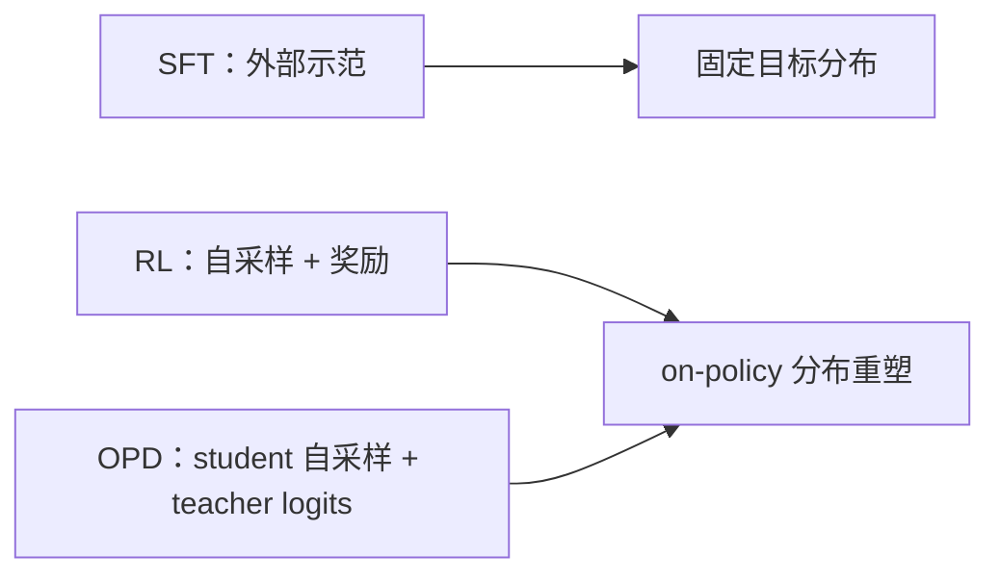
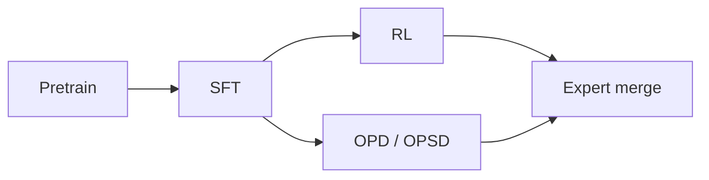

# 读 SFT、RL 与 On-Policy Distillation：后训练真正的变量是 on-policy data

这篇原文最值得带走的一句话，我会改写成：

**后训练不是在同一条损失曲线上做微调，而是在改模型会访问到的分布形状。**

SFT 把模型往外部示范拉，RL 让模型在自己会走到的状态上追逐奖励，OPD 则让 student 在自己的 prefixes 上对齐 teacher。只要盯住“数据来自哪里”，很多看起来玄学的现象就会变得很朴素：为什么 RL 和 OPD 常常比 SFT 更不容易忘，为什么 student 甚至能超过 teacher。

原文在这里：[SFT, RL, and On-Policy Distillation Through a Distributional Lens](https://nrehiew.github.io/blog/sft_rl_opd/)。

<!--more-->

## 如果只看三句话

- SFT 是把模型往一个固定的外部目标分布上拉，梯度密、覆盖面广，连和任务不太相关的 token 也会一起被推。
- RL 和 OPD 都是 on-policy：更新只发生在模型自己真的会访问到的状态上，所以它们更像“只修正当前地形附近的坡度”。
- 真正决定稳定性和泛化的，不是有没有 teacher 或 reward，而是训练状态来自静态外部分布，还是来自当前 policy 的轨迹。

## 1. 先把三种方法放到同一张图里

如果把语言模型看成“序列分布生成器”，那后训练的核心问题其实很简单：你到底在把它往哪种分布推。

### SFT：固定外部目标分布

SFT 的目标很直接：给定标注数据，最大化正确 token 的概率。

$$\mathcal{L}_{\mathrm{SFT}}(\theta) = -\mathbb{E}_{(x,y)\sim D}\sum_t \log \pi_\theta(y_t\mid x, y_{<t})$$

从分布角度看，它等价于把当前模型往数据分布上拉：

$$D_{\mathrm{KL}}(p\|q_\theta) = \sum_x p(x)\log \frac{p(x)}{q_\theta(x)}$$

问题也在这里：SFT 不太关心模型原来在哪儿。只要示范分布和原模型差得远，训练就会很像“强行改口型”。这对冷启动很有用，但也最容易带来遗忘。

### RL：在自己会到达的地方找高回报

RL 的逻辑不一样。模型先自己采样，再由 reward 决定这条轨迹该不该被强化。

$$J(\theta)=\mathbb{E}_{\tau\sim\pi_\theta}[R(\tau)]$$

如果写成最常见的 policy gradient 形式，就是：

$$\nabla_\theta J(\theta)=\mathbb{E}_{\tau\sim\pi_\theta}\big[R(\tau)\nabla_\theta \log \pi_\theta(\tau)\big]$$

这意味着 RL 的压力只会出现在模型自己真的会走到的轨迹附近。它不是把模型往一个任意外部答案硬拽，而是在当前可达区域里，找更高回报的那一块。

### OPD：介于 SFT 和 RL 之间的 pseudo RL

On-Policy Distillation 把两件事合在一起了：teacher 还在，但数据来自 student 自己。

$$\mathcal{L}_{\mathrm{OPD}}(\theta)=\mathbb{E}_{x\sim\pi_\theta}\left[D_{\mathrm{KL}}\big(\pi_\theta(\cdot\mid x)\,\|\,\pi_T(\cdot\mid x)\big)\right]$$

也就是说，它像 SFT 一样有 teacher signal，但像 RL 一样是在 student 自己采样出来的 state 上学。

## 2. 为什么 OPD 会像 RL，而不是像普通蒸馏

原文里一个很有意思的点是：OPD 不是单纯“拿 teacher 教 student”，而是“在 student 走到的地方，让 teacher 说话”。这件事比表面上听起来更重要。

### 2.1 Forward KL 和 Reverse KL 的方向感不同

SFT 可以理解成更偏 forward KL；RL 常被看成更偏 reverse KL 的优化。两者方向不同，几何意义也不同。

$$D_{\mathrm{KL}}(p\|q)=\sum_x p(x)\log\frac{p(x)}{q(x)}$$

$$D_{\mathrm{KL}}(q\|p)=\sum_x q(x)\log\frac{q(x)}{p(x)}$$

粗略地说，forward KL 更“覆盖”，reverse KL 更“挑一个像样的 mode 往里钻”。这也是为什么 reverse KL 相关方法常会表现得更像“集中火力”，而不是平均撒网。

### 2.2 更本质的不是 KL，而是 state distribution

我更认同的一点是：KL 方向只是表层解释，真正更硬的是 state distribution。

SFT 只见过 teacher 走过的前缀；一旦 student 在推理时偏了一点，后面的状态就可能是 teacher 从没见过的。这个 mismatch 会把误差一层层放大。

RL 和 OPD 不一样。它们都在 student 自己会到达的状态上训练，所以更新天然被限制在“当前模型真的会去的地方”。这会让训练轨迹更像自我纠偏，而不是外部强灌。

从这个角度看，RL 可以理解成：在所有可行解里，找离当前 policy 最近的那个 task-solving policy。

### 2.3 为什么 OPD 需要 per-token clipping

OPD 不是无脑蒸馏。因为 teacher 和 student 往往很接近，真正拉开差距的，反而常常是一些风格词、转折词、思考词，而不是最关键的数学 token。

这就带来一个问题：如果对这些高 KL token 也更新太猛，模型可能会被不重要的部分带偏。于是就需要一种按 token 截断的机制，避免过度更新。

换句话说，OPD 在做的不是“把所有 token 都重写一遍”，而是“只在值得改的地方改得更狠一点”。

## 3. 为什么 RL 和 OPD 往往比 SFT 更不容易忘

原文给了几种解释，但我觉得最顺的一条还是：on-policy data 本身就在帮你做约束。

### 3.1 SFT 的问题是它太像“硬拷贝”

SFT 的监督是密的，几乎每个 token 都在被拉高概率。问题在于，模型并不知道哪些 token 是任务关键，哪些只是表面风格。

所以它会对整条轨迹都施压，更新范围大，副作用也大。这就是为什么 SFT 很适合格式迁移，却也更容易把原本会的东西一起磨掉。

### 3.2 RL 的更新更稀疏，也更贴近当前模型

RL 的奖励通常只对少数成功轨迹有效。哪怕你不把它写成一个很强的显式 KL 约束，它仍然会把更新限制在当前 policy 可访问的区域里。

原文的那个 toy figure 很直白：reverse KL 往往更不容易把原先的多个 mode 一起抹掉，因为它更像是在已有模式上找一个更尖锐的解，而不是把所有可能都平均覆盖掉。

### 3.3 OPD 的反直觉结果：teacher 不是唯一关键

最让我印象深的实验是这个：OPD student 不但没被 teacher 限死，反而常常比 teacher 更稳。

| 模型 | Pass@1 ↑ | Norm. Levenshtein ↓ | Added CC ↓ | LiveCodeBench v6 ↑ |
| :--- | ---: | ---: | ---: | ---: |
| SFT teacher | 0.775 | 0.450 | 0.450 | 0.286 |
| RL teacher | 0.792 | 0.063 | 0.206 | 0.320 |
| OPD student（SFT teacher） | 0.800 | 0.059 | 0.206 | 0.297 |
| OPD student（RL teacher） | 0.787 | 0.055 | 0.228 | 0.314 |

这些数的意思很简单：OPD student 在最小编辑任务上更好，至少在这个设置里，它并没有继承 teacher 的坏毛病，反而保住了更多通用能力。

这说明一件事：**on-policy sampling 这个数据来源，比 teacher 本身更像是决定性的变量。**

## 4. 为什么 OPD 的 reward 会涨得更突然，entropy 会掉得更快

分布视角还有一个很有用的现象：它能解释为什么 OPD 的训练曲线看起来更“猛”。

如果你把 reverse KL 看成一种 mode-seeking 的训练，它就很容易把分布往少数高置信 mode 上压。于是 reward 可能跳得更快，但 entropy 也会更快塌下来。

这未必是坏事，只是它提醒我们：OPD 不是在追求“更多样”，而是在追求“更像样的那个 mode”。在某些任务上，这种收缩反而是有利的。

## 5. 为什么 student 甚至能超过 teacher

这个结果一开始看起来很奇怪，但其实很合理。

第一，OPD 用的是 student 自己生成的状态。student 的错误不等于 teacher 的错误，所以 teacher 给的监督会更贴近 student 真正会犯错的地方。

第二，KL matching 不是 reward maximization。teacher distribution 里不只有“正确答案”，还有风格、犹豫、候选分支和 reasoning 结构。把这些分布信息学回来，有时会把采样行为整体往更好的方向推。

所以 student 超过 teacher，并不一定意味着 teacher 不行，而是说明“分布形状”本身就可能携带额外价值。

## 6. 如果把它放回完整后训练流水线

大多数开放模型的后训练，基本都长得像 `Pretrain -> SFT -> RL -> OPD`。

SFT 负责把模型从纯预训练语言模型改造成能听指令的模型；RL 负责把能力往任务成功方向推；OPD 则越来越像一种“专家能力合并”的原语。

原文里引用的 MiMo-V2 Flash 表格也在强调同一个趋势：不同域会偏好不同的后训练方式，数学和代码更偏 RL，写作和知识类任务更常见 distillation 或 self-distillation。最后真正落地的，往往不是“单一路线赢全场”，而是某种 expert merge。

## 7. 我自己的收获

如果把这篇文章压缩成一个可复用的判断，我会这么记：

- 想保住原有能力，先问训练状态来自哪里；
- 想让能力增长又不把 KL 花光，on-policy data 往往是最关键的杠杆；
- 想把 distillation 用好，就别只盯 teacher logits，还要盯 student 会走到什么状态；
- 真正难的地方不是“有没有监督”，而是 credit assignment 到底有多稀疏。

所以未来更好的 post-training 算法，可能既要有 distillation 的密度，又要有 RL 的低偏差，还要保留 on-policy 这个最朴素但最值钱的约束。

## 参考链接

- [SFT, RL, and On-Policy Distillation Through a Distributional Lens](https://nrehiew.github.io/blog/sft_rl_opd/)
- [On-Policy Distillation 相关工作](https://arxiv.org/)
- [MiMo-V2 Flash technical report](https://arxiv.org/)

