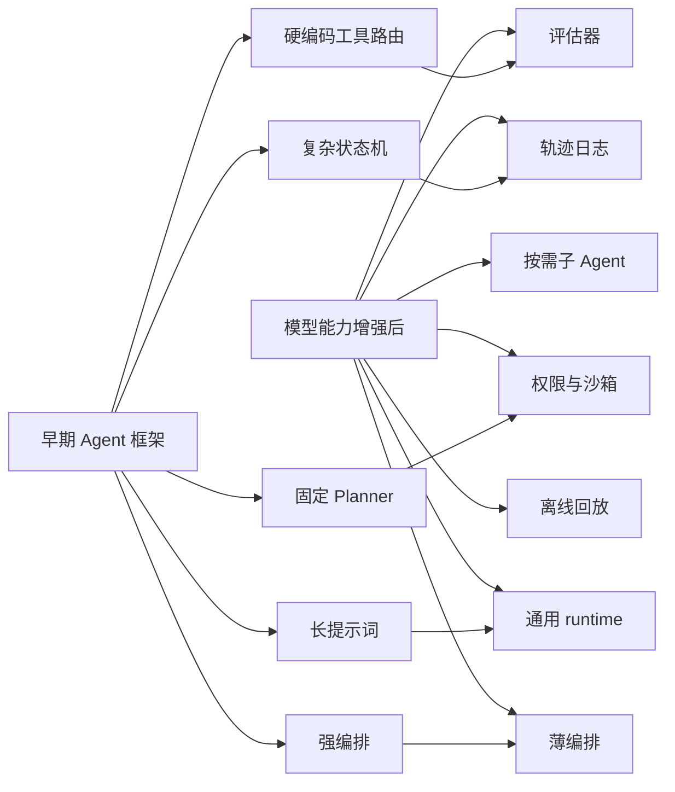

# 模型更强之后，Agent 框架会怎样退到 runtime


模型 Agent 能力变强以后，Agent 框架最该简化的，不是安全、日志和评估，而是那些替模型思考、替模型排流程、替模型猜工具的调度层。

更强的模型会把框架从“保姆式编排器”推向“操作系统式运行时”：少写死流程，多提供工具、权限、记忆、回放、评估、隔离和可观测性。框架不再像项目经理一样一步步指挥模型怎么做，而更像一个可靠的工作台：模型自己规划，但所有动作都可控、可追踪、可复盘。

这里有一个很关键的前提：Agent 的训练资产是轨迹，不只是聊天内容。当模型从大量轨迹中学会了工具使用、规划、错误恢复和上下文选择之后，今天很多硬编码在框架里的模块，就会被反向压缩。它们不会全部消失，但会从复杂的认知编排，退到更薄、更通用、更声明式的 runtime 能力里。

## 显式 Planner 会被弱化

今天很多 Agent 框架都有显式 Planner：先生成计划，再拆任务，再逐步执行，再检查结果。模型能力较弱时，这很有用。因为模型容易忘步骤、乱调用工具、过早结束，外部 Planner 可以帮它保持方向。

但如果模型已经通过大量轨迹学会了这些习惯：

```text
先观察环境；
先读相关文件；
先运行最小验证；
再小范围修改；
修改后重新测试；
失败后换策略；
危险操作前请求确认；
完成前给出证据。
```

那么框架里的 Planner 就可以明显变薄。未来可能不再需要复杂的任务分解器、计划节点图、固定阶段流程，而只需要给模型一个清晰目标、工具集合、约束条件和评估标准。

| 当前框架做法 | 模型变强后的方向 | 仍然要保留 |
| --- | --- | --- |
| 框架强制生成计划 | 模型自主决定是否需要计划 | 计划日志、审计记录 |
| 固定步骤：搜索 -> 读取 -> 编辑 -> 测试 | 模型按任务动态选择步骤 | 工具权限、执行结果 |
| 人工设计任务状态机 | 简化为通用循环 | 中断、恢复、回放能力 |
| 框架判断下一步 | 模型根据证据判断 | 外部验证器 |

Planner 可以弱化，但不一定完全消失。高风险任务、长周期任务、多系统协作任务，仍然需要某种外部计划表示，方便人类审查和系统回放。

## 复杂状态机会回到简单循环

很多框架喜欢把 Agent 流程做成复杂状态图：

```text
Plan -> Search -> Read -> Edit -> Test -> Reflect -> Retry -> Final
```

这在早期很直观，但也容易变僵硬。真实任务往往不是线性的。修一个测试时，模型可能要在读文件、跑测试、理解报错、小改代码、回滚修改之间来回跳转。

如果模型能力更强，框架可以回到一个更简单的核心循环：

```text
observe -> decide -> act -> observe -> continue / stop
```

这更接近人类工作方式。一个资深工程师不会严格按固定流程工作，而是根据当前证据决定下一步。

所以，未来 Agent 框架的主循环可能越来越简单，但周边基础设施会越来越成熟：

```text
模型负责决策；
框架负责执行、隔离、记录、验证、回滚、权限和评估。
```

关键不是规定下一步必须是什么，而是确保每一步都能被记录、被约束、被验证。

## 工具路由会从规则选择变成模型选择

现在很多 Agent 框架会写大量工具路由规则：

```text
用户问代码问题时先搜索；
用户说测试失败时先读测试文件；
看到报错时调用日志分析工具；
需要联网时调用网页工具；
代码修改后自动运行测试。
```

这些规则在模型不稳定时很有用。但规则越写越多，就会互相冲突，也很难适配复杂场景。

当模型从轨迹数据中学会工具使用策略后，工具路由层可以变薄。框架只需要告诉模型：

```text
有哪些工具；
每个工具能做什么；
输入参数格式是什么；
成本和风险是什么；
调用后会返回什么；
哪些工具需要权限。
```

模型自己决定什么时候用哪个工具。

不过，工具执行不能放任。更合理的方式是：

```text
模型选择工具；
框架检查工具是否存在、参数是否合法、风险是否可接受；
执行环境返回结构化结果；
评估器判断这次工具调用是否有效。
```

也就是说，工具选择可以更多交给模型，工具执行必须留在框架。

## 上下文管理会从硬压缩转向主动取用

append-only 轨迹日志和上下文压缩，是 Agent 框架里非常关键的部分。今天很多框架需要复杂的 context compaction，因为模型上下文有限，也不一定知道哪些信息重要。

所以框架会做很多事：

```text
截断旧消息；
压缩工具输出；
总结历史对话；
保留最近片段；
把子 Agent 结果变成摘要；
把长日志裁剪成短日志。
```

当模型长上下文、检索和信息选择能力增强后，框架可以减少一部分强行替模型压缩的逻辑，转而提供更好的信息访问方式。

未来可能从：

```text
框架提前决定哪些上下文塞给模型
```

变成：

```text
框架保存完整轨迹，模型按需查询、展开、回看、索引和比较
```

这像是从“提前打印一叠材料”变成“有一个结构清晰的档案室，需要什么自己查”。

但原始轨迹仍然必须保存。上下文是给模型当下使用的，轨迹日志是给调试、评估、训练、审计和回放使用的。两者不是一回事。

可以简化的是：

```text
复杂的上下文拼接策略；
过多的手工摘要规则；
僵硬的 token 预算分配；
固定的历史截断方式。
```

不能简化的是：

```text
原始轨迹记录；
工具调用记录；
权限决策记录；
执行结果记录；
错误恢复记录；
压缩边界记录。
```

## 子 Agent 调度会从固定分工变成按需委派

很多 Agent 框架会设计一组固定角色：

```text
Planner agent；
Coder agent；
Reviewer agent；
Tester agent；
Research agent；
Security agent。
```

模型较弱时，多角色架构能帮助拆分任务。但随着单个模型能力增强，固定多 Agent 架构会显得臃肿。

更合理的方向是：

```text
默认单 Agent；
只有在任务复杂、需要并行搜索、独立验证、上下文隔离或安全隔离时，才临时创建子 Agent。
```

修一个小测试，不需要 Planner、Coder、Tester 三个角色轮流上场。一个强模型自己读文件、改代码、跑测试就够了。

但大型重构里，子 Agent 仍然有价值：

```text
一个子 Agent 调研影响范围；
一个子 Agent 分析测试失败；
一个子 Agent 检查安全风险；
一个子 Agent 做独立代码审查。
```

未来不是永远多 Agent，而是按需组队。

## 反思模块会从每步自省变成关键节点验证

早期框架喜欢让模型频繁反思：

```text
我刚才做得对吗？
下一步应该是什么？
有没有遗漏？
是否需要重试？
```

这能缓解模型不稳定，但也会带来大量自言自语。更糟的是，模型自己评价自己并不总是可靠。它可能把错误解释得很合理，也可能在没有证据时过早确认成功。

未来更好的方向是：

```text
少一点模型自评；
多一点真实环境反馈。
```

让系统检查：

```text
测试是否通过；
构建是否成功；
lint 是否通过；
diff 是否合理；
权限是否合规；
用户目标是否满足；
有没有引入新错误。
```

Agent 后训练真正需要的 outcome signal，不是模型更会解释自己为什么对，而是模型更会根据真实反馈调整行为。

## 长提示词会变成能力内化加外部规则

今天很多 Agent 框架依赖很长的系统提示词，告诉模型：

```text
你要先读文件；
不要乱改代码；
修改后要测试；
遇到权限问题要询问；
不要过早结束；
不要编造结果；
不要重复失败命令；
输出格式要这样；
工具调用要那样。
```

这些提示词本质上是在弥补模型训练不足。

如果模型通过高质量轨迹训练，把这些工作习惯内化了，框架就可以减少大量保姆式提示词。提示词会从行为说明书，变成运行时配置。

比如从：

```text
你必须先分析用户需求，然后制定计划，然后读取相关文件，然后……
```

变成：

```text
目标：修复失败测试。
约束：不要执行破坏性命令；修改后必须验证；遵守项目风格。
可用工具：Read、Edit、Bash。
完成条件：相关测试通过。
```

提示词不会消失。它会分成两类：通用工作习惯通过训练内化；项目规则、安全规则、用户偏好和当前任务目标，仍然由外部配置注入并由框架执行。

## 错误恢复会从规则补丁变成失败轨迹学习

现在很多框架会为常见失败写补丁逻辑：

```text
命令超时就重试；
测试失败就重新读取日志；
编辑冲突就恢复文件；
工具失败就换另一个工具；
上下文太长就压缩；
权限被拒绝就换安全命令。
```

这些规则实用，但会越积越多，最后框架变成一堆 if-else。

如果模型从大量失败轨迹中学会错误恢复，部分补丁逻辑就可以下沉到模型能力里。模型会自然学到：

```text
测试命令失败时先看错误信息，不要盲目重跑；
文件不存在时先搜索路径，不要直接创建同名文件；
权限被拒绝后找替代方案，不要重复请求；
大范围修改失败后回到更小 patch；
运行全量测试太慢时先跑最小相关测试；
同一错误重复出现时换定位策略。
```

但底层恢复能力仍然要留在框架里：

```text
事务化编辑；
回滚机制；
超时控制；
中断机制；
session resume；
fork / rewind；
工具错误结构化返回。
```

错误恢复策略可以更多交给模型，错误恢复能力必须由框架提供。

## 权限系统可以少打扰，但不能变弱

这是最容易被误解的一点。模型变强后，权限系统不是被取消，而是从频繁询问用户，升级为更聪明的分层控制。

今天很多 Agent 的权限体验是：

```text
这个命令可以执行吗？
那个文件可以改吗？
这个操作要允许吗？
```

用户会疲劳，最后可能无脑批准。

如果模型和风险分类器能力提升，框架可以减少低风险操作的确认，比如读取项目文件、运行测试、运行 lint、小范围编辑非敏感文件、查看 git diff。

但高风险操作仍然必须严格控制：

```text
删除大量文件；
重置版本历史；
上传数据；
执行未知脚本；
修改权限配置；
访问敏感凭据；
影响生产环境。
```

未来权限系统的方向是：

```text
从每步弹窗，变成策略边界；
从人工疲劳确认，变成风险分级；
从单一 allow/deny，变成 allow / ask / deny / sandbox / rewrite；
从静态规则，变成规则 + 分类器 + 沙箱 + 审计。
```

权限可以更少打扰，但不能更弱。

## Verifier 会比 Planner 更重要

当模型更会自己规划和执行以后，框架的重心会从“指挥模型干活”转向“判断活干得好不好”。

也就是说，未来 Agent 框架里最重要的模块之一不是 Planner，而是 Verifier。

因为模型越自主，越需要独立验收。否则它可能看起来完成了任务，但实际情况是：

```text
测试没有跑；
只修了表面错误；
改坏了别的模块；
忽略了用户约束；
引入了安全风险；
生成了漂亮但错误的解释。
```

所以，框架可以减少显式调度，但要加强：

```text
任务完成度评估；
代码 diff 质量评估；
测试充分性评估；
安全风险评估；
用户意图一致性评估；
回归测试评估；
离线 replay 评估。
```

这是从“我来告诉你每一步怎么做”，变成“你自己做，但我要严格验收”。

## 记忆系统会从存聊天变成存可复用经验

轨迹日志不等于长期记忆。未来框架可以把记忆系统分成两层：

```text
完整轨迹日志：用于审计、回放、训练、调试。
抽象经验记忆：用于未来任务复用。
```

完整轨迹里有很多细节：用户说了什么，模型读了哪些文件，运行了哪些命令，哪次失败了，最后改了哪几行，测试怎么通过的。

长期记忆真正需要保留的，通常是更稳定的项目知识：

```text
这个项目用 pnpm，不用 npm；
测试命令是 pnpm test --filter；
auth 模块入口在 src/auth/index.ts；
用户偏好小范围 diff；
这个仓库不允许直接修改生成文件；
某类错误通常来自 mock 配置。
```

成熟做法应该是：

```text
先记录原始轨迹；
再抽取候选记忆；
再经过验证或用户确认；
最后进入长期记忆。
```

这样可以避免把一次临时现象误记成长期规则。

## 框架会从 Agent 编排框架变成 Agent runtime

早期 Agent 框架像一个编排系统，重点是：

```text
怎么拆任务；
怎么排流程；
怎么选工具；
怎么让多个 agent 协作；
怎么让模型反思；
怎么写提示词。
```

模型能力提升后，框架会更像一个运行时系统，重点变成：

```text
权限；
沙箱；
工具协议；
状态管理；
轨迹日志；
中断恢复；
离线回放；
评估验收；
策略配置；
数据脱敏；
多版本实验；
可观测性。
```

换句话说，未来优秀 Agent 框架不一定是最会帮模型思考的框架，而是最能安全、稳定、可审计地让模型做事的框架。

可以用这张图概括：



## 哪些模块可以简化，哪些不能

可以用一个简单标准判断：

> 凡是为了弥补模型不会工作而存在的模块，可以逐步简化；凡是为了约束真实世界副作用而存在的模块，不能轻易简化。

| 模块 | 是否可简化 | 原因 |
| --- | --- | --- |
| 显式 Planner | 可以明显简化 | 模型会更擅长自主规划 |
| 固定状态机 | 可以简化 | 真实任务更适合动态循环 |
| 工具路由规则 | 可以简化 | 模型会学会选工具 |
| 长提示词模板 | 可以简化 | 通用行为可通过训练内化 |
| 反思链路 | 可以部分简化 | 外部验证比自我反思更可靠 |
| 子 Agent 固定分工 | 可以简化 | 按需创建更灵活 |
| 上下文硬压缩 | 可以部分简化 | 模型可主动检索和取用 |
| 权限系统 | 不能弱化 | Agent 有真实副作用 |
| 轨迹日志 | 不能弱化 | 调试、评估、训练都依赖它 |
| 沙箱隔离 | 不能弱化 | 防止错误或越权操作 |
| 离线回放评估 | 不能弱化 | 新模型上线前必须验证 |
| 数据脱敏治理 | 不能弱化 | 轨迹数据高度敏感 |

## 一个更理想的未来架构

我觉得更合理的演进方向是：

```text
薄 Loop + 强 Runtime + 强 Verifier + 强 Data Flywheel
```

具体流程可以写成：

```text
用户目标
-> 模型自主规划与行动
-> 工具运行时执行
-> 权限和沙箱控制副作用
-> 轨迹日志完整记录
-> 评估器判断质量
-> 失败样本进入训练闭环
-> 新模型通过离线回放后上线
```

对应到框架设计，就是：

```text
少写死流程；
少写死角色；
少写死工具选择；
少依赖长提示词；
多保留执行证据；
多做权限分层；
多做结果验证；
多做轨迹回放；
多做数据治理。
```

这和“不要只训练更会写代码，而要训练更会工作”是一回事。当模型真的更会工作后，框架不需要像保姆一样提醒它先看文件、再运行测试、再修改、再验证。

但框架也不会消失。更准确地说，它会下沉。

```text
模型越强，框架越不需要替它思考；
模型越强，框架越需要管住它的行动边界。
```

早期框架承担的是认知脚手架：帮模型规划、拆解、反思、选工具。未来框架承担的是执行基础设施：权限、工具、沙箱、日志、记忆、评估、回放、数据闭环。

这就像程序员水平提高后，不需要 IDE 每一步教他怎么写代码，但仍然需要 Git、CI、测试、权限、日志、监控和代码评审。

Agent 框架的最终形态，可能不是一个复杂的智能编排器，而是一个可靠的智能操作系统：模型负责越来越多的判断，框架负责让这些判断安全、可控、可验证、可持续进化。


